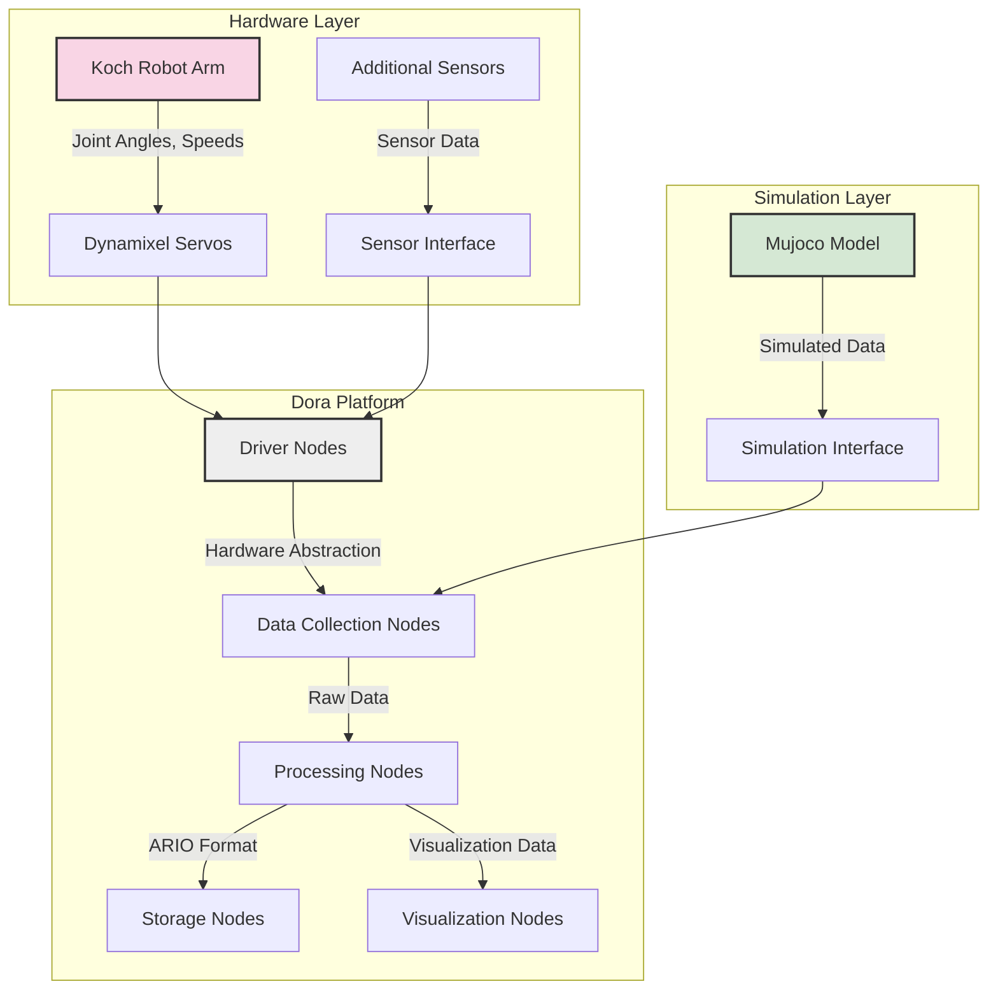
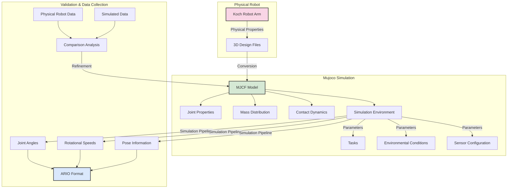
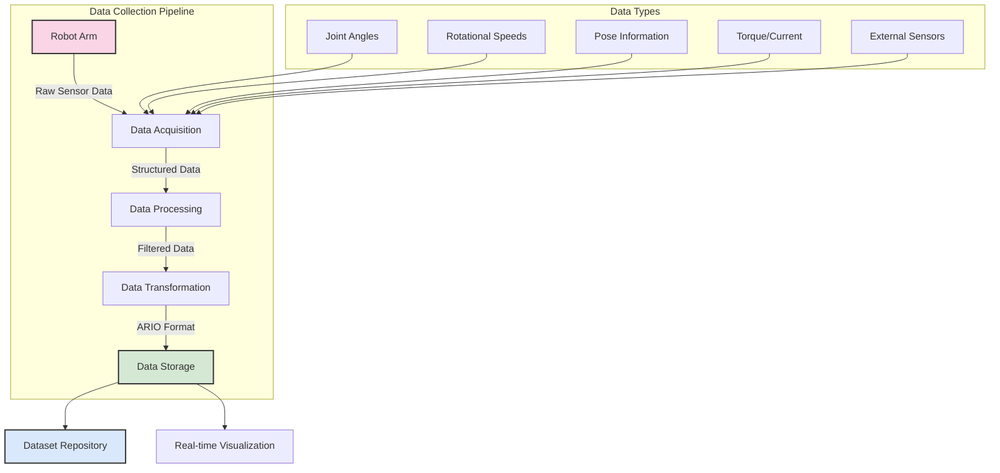

# GSoC 2025 Proposal: Robot Data Collection Improvement

## Personal Information
- **Name:** Munish Mummadi
- **Email:** moneymindedmunish1@gmail.com
- **GitHub:** https://github.com/MunishMummadi
- **LinkedIn:** https://www.linkedin.com/in/munishmummadi/
- **University:** Saint Louis University
- **Program:** Masters in Computer Information Science
- **Expected Graduation:** May 2025
- **Educational Background:** Bachelor's in Mechanical Engineering

## Project Information
- **Project Title:** Robot Data Collection Improvement
- **Organization:** Dora
- **Mentors:** bding@dora-rs.org, huangyu@dora-rs.org

# Introduction and Background

## Personal Information

My name is Munish Mummadi, and I am currently pursuing a Master's degree in Computer Information Science at Saint Louis University, with an expected graduation date of May 2025. With a Bachelor's degree in Mechanical Engineering and practical experience in software engineering, I bring a unique interdisciplinary perspective to the Robot Data Collection Improvement project for Dora.

As a software engineer with over two years of experience developing scalable web applications, I have cultivated expertise in Python, Golang, and JavaScript. My combined mechanical engineering background and software development skills equip me with the technical knowledge and problem-solving mindset necessary to tackle complex challenges in robotics data collection.

## Mechanical Engineering Background and Relevance 

As a mechanical engineering graduate, I bring a unique perspective to this robotics data collection project that complements my software development skills. My mechanical engineering background provides me with several advantages that will be instrumental in successfully executing this project:

1. **Understanding of Mechanical Systems**: My education in mechanical engineering has given me a some level of understanding of the principles governing robotic mechanisms, including kinematics, dynamics, and structural analysis. This knowledge will be crucial when adapting the Koch robot arm design for data collection purposes, as I can make informed decisions about structural modifications, joint configurations, and load-bearing capabilities.

2. **3D Design and Manufacturing Knowledge**: Throughout my mechanical engineering curriculum, I gained extensive experience with CAD software and 3D printing technologies. I understand the design considerations necessary for creating parts that are both functional and manufacturable, including tolerances, material properties, and assembly constraints. I am little rusty with CAD software, but I am confident in my ability to learn and apply it effectively.

3. **Sensor Integration Experience**: My mechanical engineering background includes experience with various sensors and measurement systems, providing me with insights into optimal sensor placement, mounting considerations, and signal integrity. This knowledge will help me design effective mounting points for additional sensors on the robot arm, ensuring high-quality data collection without compromising the arm's functionality.

4. **Physical Simulation Understanding**: I am reading the docs to better understand the Mujoco physics engine. My education included courses on dynamics and simulation of mechanical systems(need to recap though), giving me foundational knowledge for working with the Mujoco physics engine. I understand the physical parameters that need to be accurately modeled, such as mass properties, friction coefficients, and joint constraints, which will help me create a more realistic simulation of the robot arm. 

5. **Interdisciplinary Approach**: The combination of my mechanical engineering background and software development skills allows me to bridge the gap between hardware and software aspects of this project. I can effectively translate mechanical design requirements into software implementations and vice versa, ensuring a cohesive and well-integrated system.

This interdisciplinary background makes me uniquely qualified to tackle the Robot Data Collection Improvement project, as it requires expertise in both mechanical design and software development. By leveraging my mechanical engineering knowledge alongside my programming skills, I can deliver a comprehensive solution that addresses both the hardware and software challenges of affordable robot data collection.

## Project Motivation

The field of robotics is experiencing unprecedented growth, with applications spanning from industrial automation to healthcare and beyond. However, a significant barrier to innovation in this domain is the high cost and complexity associated with robot data collection. This challenge particularly affects researchers, students, and small organizations who lack access to expensive commercial robotics platforms but have valuable contributions to make to the field.

My interest in this project stems from a deep fascination with the intersection of software engineering and robotics. During my academic journey, I've been particularly drawn to projects that bridge theoretical concepts with practical applications. The opportunity to create an affordable, accessible robot kit specifically designed for data collection aligns perfectly with my belief that technological advancement should be democratized and made available to a wider audience.

The Dora Robot Data Collection Improvement project represents an exciting opportunity to address these challenges by creating an end-to-end solution that combines affordable hardware with powerful software capabilities. By leveraging open-source designs like the Koch robot arms and integrating them with the Dora platform, we can significantly lower the barrier to entry for robotics research and development.

## Project Understanding

Robot data collection is currently expensive and difficult to manage for several reasons:

1. Commercial robotics platforms often come with huge costs, limiting access for many researchers and educational institutions.
2. Existing solutions frequently lack standardized data formats, making it challenging to share and compare results across different platforms.
3. The integration between hardware and software components often requires specialized knowledge, creating additional barriers to entry.
4. Documentation and tutorials for affordable robotics solutions are often fragmented or incomplete.

The Dora platform, with its dataflow-oriented architecture and focus on AI-based robotic applications, provides an excellent foundation for addressing these challenges. By combining Dora's software capabilities with affordable hardware solutions, we can create a comprehensive system that enables researchers to collect valuable robot data without significant financial investment.

This project aims to create end-to-end tutorials with an affordable robot kit specifically designed around the Dora platform. The system will facilitate the collection of data that can be used for various applications such as robotics research, algorithm development, and model training. By following the ARIO unified data format or the LeRobot Dataset format, the collected data will be standardized and easily shareable within the open-source community.

The project will involve designing and 3D printing robot components based on the Koch robot arm design, creating a Mujoco robot model for simulation, implementing data collection nodes in Dora, and developing comprehensive documentation to help the community replicate the system. This holistic approach will address both the hardware and software aspects of robot data collection, making it more accessible to a wider audience.

## System Architecture Overview

The following diagram illustrates the high-level architecture of the proposed system, showing the relationships between the hardware layer, Dora platform, and simulation layer:

## Relevance to Dora

The Dora platform (Dataflow-Oriented Robotic Architecture) is uniquely positioned to benefit from this project due to its focus on streamlining and simplifying the creation of AI-based robotic applications. Dora offers low latency, composable, and distributed dataflow capabilities, making it an ideal platform for robot data collection.

This project aligns perfectly with Dora's architecture and capabilities:

1. Dora's dataflow-based approach, where applications are modeled as directed graphs (pipelines), provides a natural framework for implementing data collection nodes.
2. The platform's support for various hardware and sensors, including cameras, peripherals, actuators, and robot arms, makes it well-suited for integration with the Koch robot arm design.
3. Dora's experimental support for Mujoco simulation enables the creation of a digital twin of the physical robot, allowing for data collection in both simulated and real environments.
4. The platform's Python API facilitates easy development and integration of custom data collection solutions.

By creating an affordable robot kit specifically designed for the Dora platform, this project will expand Dora's accessibility and usefulness to a broader community of researchers, educators, and hobbyists. The comprehensive tutorials and documentation developed as part of this project will lower the barrier to entry for new users, potentially growing the Dora ecosystem and contributing to its long-term sustainability.

Furthermore, the standardized dataset collected and shared through this project will provide valuable resources for the robotics community, potentially accelerating research and development in areas such as robot learning, control systems, and human-robot interaction.

# Technical Approach

## Robot Design and 3D Printing

The foundation of this project is the creation of an affordable robot kit specifically designed for data collection with the Dora platform. To achieve this, I will adapt the Koch robot arm design, which has gained popularity in the robotics community for its accessibility and effectiveness. The Koch design offers several advantages that make it ideal for this project: it costs approximately $250-430 depending on configuration, uses lightweight components, and is fully 3D-printable with commercially available parts.

The adaptation process will begin with a thorough analysis of the original Koch design, focusing on optimizing it for data collection purposes. This will involve several key considerations:

First, I will evaluate the existing design files (STL and step files) to identify opportunities for improvement and customization. The current Koch design uses Dynamixel servo motors, with XL430 motors for the first two joints (providing greater strength) and XL330 motors for the remaining joints (offering reduced weight). This configuration creates a balance between power and agility that is well-suited for data collection tasks.

For the 3D printing aspects, I will optimize the design files to ensure they are printable on a wide range of consumer-grade 3D printers. This includes adjusting tolerances, adding support structures where necessary, and providing detailed printing parameters (temperature, infill percentage, layer height, etc.) to ensure consistent results across different printing setups. The parts will be designed to minimize the need for supports, reducing material waste and post-processing time.

Component selection will be guided by the principle of affordability without compromising functionality. The bill of materials will include:
- Dynamixel servo motors (or compatible alternatives if more cost-effective options are identified)
- Waveshare Serial Bus Servo Driver Board (a more affordable alternative to the Dynamixel U2D2 adapter)
- Voltage reducer for powering the servos
- Standard power supply
- Table mounting clamp
- Necessary wiring and connectors

To enhance the data collection capabilities, I will incorporate additional mounting points for sensors such as cameras, IMUs, and force sensors. These modifications will be designed to maintain the structural integrity of the arm while expanding its functionality for diverse data collection scenarios.

The assembly process will be thoroughly documented with step-by-step instructions, accompanied by clear photographs and diagrams. This documentation will include detailed wiring diagrams, motor configuration instructions, and troubleshooting guides to ensure users can successfully build the robot arm regardless of their prior experience with robotics hardware.

## Mujoco Robot Model

Creating an accurate Mujoco simulation model of the robot arm is a critical component of this project. Mujoco (Multi-Joint dynamics with Contact) is a physics engine designed for robotics research that offers a unique combination of speed, accuracy, and modeling power. It is particularly well-suited for this project due to its ability to simulate articulated structures with contacts, which is essential for realistic robot arm simulation.

The following diagram illustrates the Mujoco simulation workflow, from physical robot properties to data collection and validation:

The development of the Mujoco model will begin with the conversion of the 3D design files into Mujoco's XML-based model format (MJCF). This process will involve defining the kinematic structure of the robot, including joint types, ranges of motion, and mass properties. I will ensure that the simulated model accurately reflects the physical properties of the real robot arm, including dimensions, weight distribution, and inertial characteristics.

The simulation environment will be configured to replicate typical data collection scenarios, with adjustable parameters for environmental conditions, task definitions, and sensor configurations. This will allow users to test their data collection methodologies in a controlled virtual environment before deploying them on physical hardware.

A key advantage of using Mujoco is its ability to generate synthetic data that can serve as a baseline or supplement to real-world data collection. I will implement data collection pipelines within the simulation environment that mirror those used with the physical robot, ensuring consistency between simulated and real-world data. This includes collecting joint angles, rotational speeds, pose information, and other relevant metrics in formats compatible with the ARIO unified data format.

To validate the accuracy of the simulation, I will develop comparison methodologies that quantify the differences between simulated and real-world data. This validation process will involve executing identical movements on both the physical robot and its simulated counterpart, then analyzing the resulting data to identify discrepancies. Based on these findings, I will refine the simulation parameters to minimize the reality gap.

The Mujoco model will also serve as a valuable tool for preliminary testing and algorithm development. Users will be able to prototype data collection strategies, test control algorithms, and identify potential issues before implementing them on physical hardware. This capability is particularly valuable for educational settings where access to physical robots may be limited.

## Dora Data Collection Nodes

The integration with the Dora platform represents the software core of this project. Dora's dataflow-oriented architecture, where applications are modeled as directed graphs (pipelines), provides an ideal framework for implementing modular and reusable data collection nodes.

The following diagram illustrates the data collection pipeline, from raw sensor data to storage and visualization:

I will develop a comprehensive set of data collection nodes specifically designed for the Koch robot arm. These nodes will be implemented using Dora's Python API, leveraging the platform's efficient shared memory and Apache Arrow capabilities for zero-copy operations. The nodes will be designed to collect various types of data, including:

- Joint angles and positions
- Rotational speeds and accelerations
- End-effector pose information
- Motor torque and current consumption
- External sensor data (cameras, IMUs, etc.)

The implementation will follow Dora's node architecture, with clear input and output specifications, configuration parameters, and error handling mechanisms. Each node will be designed to be composable, allowing users to create custom data collection pipelines tailored to their specific research needs.

A key aspect of this implementation will be the adoption of the ARIO unified data format. ARIO (All Robots In One) is a standardized format that enhances existing datasets by offering a unified structure, comprehensive sensory modalities, and a combination of real-world and simulated data. By implementing ARIO support in the data collection nodes, we ensure that the collected data is compatible with a wide range of existing datasets and tools.

The data collection system will include real-time processing capabilities, allowing users to visualize and analyze data as it is being collected. This will be implemented using Dora's visualization tools, such as the Plot and Rerun nodes, providing immediate feedback on the quality and characteristics of the collected data.

Storage solutions will be implemented to efficiently manage the potentially large volumes of data generated during collection sessions. This includes compression algorithms, filtering options to reduce redundancy, and metadata tagging for improved searchability and organization.

To ensure seamless integration between the physical robot and the Dora platform, I will develop driver nodes that handle the low-level communication with the Dynamixel servos. These drivers will abstract the hardware details, providing a clean interface for the higher-level data collection nodes.

## Documentation and Tutorials

Comprehensive documentation and tutorials are essential for the success and adoption of this project. I will create detailed, step-by-step guides that cover all aspects of the system, from hardware assembly to software configuration and data collection.

The documentation will be structured in a modular fashion, allowing users to focus on the specific aspects relevant to their needs. It will include:

1. Hardware assembly guides with detailed photographs, diagrams, and video tutorials
2. 3D printing instructions, including recommended printer settings and troubleshooting tips
3. Software installation and configuration guides for the Dora platform
4. Step-by-step tutorials for setting up the Mujoco simulation environment
5. Comprehensive documentation of the data collection nodes, including API references and usage examples
6. Guides for implementing the ARIO data format in various collection scenarios
7. Example data collection workflows for common research tasks
8. Troubleshooting guides addressing common issues and their solutions

The tutorials will be designed to accommodate users with varying levels of experience, from beginners who are new to robotics to advanced users who want to extend and customize the system. Each tutorial will include clear learning objectives, prerequisites, and expected outcomes.

To facilitate community engagement and contributions, I will develop contribution guidelines that outline how others can extend the system, add new features, or improve existing components. This will include coding standards, pull request procedures, and documentation requirements.

All documentation will be made available through multiple channels, including the project's GitHub repository, the Dora platform's official documentation, and potentially dedicated tutorial websites. The materials will be formatted for easy consumption on various devices, ensuring accessibility for all users.

By providing comprehensive documentation and tutorials, this project will not only deliver a functional robot data collection system but also empower the community to adopt, extend, and improve upon it, fostering a sustainable ecosystem around affordable robot data collection.

# Implementation Plan and Timeline

## Implementation Plan

The implementation of the Robot Data Collection Improvement project will follow a structured approach divided into four main phases. Each phase builds upon the previous one, ensuring a logical progression from design and prototyping to a complete, well-documented system.

### Phase 1: Design and Prototyping (Weeks 1-3)

The initial phase focuses on establishing a solid foundation for the project by finalizing the robot arm design and preparing for its physical implementation.

During this phase, I will begin by conducting a thorough analysis of the Koch robot arm design, identifying opportunities for optimization and customization for data collection purposes. This will involve reviewing the existing STL files, examining the component specifications, and understanding the assembly process in detail. I will then adapt the design to better integrate with the Dora platform, adding mounting points for additional sensors and making adjustments to improve data collection capabilities.

Once the design modifications are complete, I will create a comprehensive bill of materials (BOM) that includes all necessary components, their specifications, and sourcing information. This BOM will be optimized for cost-effectiveness without compromising functionality, ensuring the robot kit remains affordable and accessible.

With the design and BOM finalized, I will proceed to the initial 3D printing and assembly tests. This will involve printing prototype components, assembling them, and evaluating their fit, stability, and functionality. Any issues identified during this testing phase will be addressed through iterative design refinements.

By the end of Phase 1, I will have a functional prototype of the robot arm, a complete set of optimized design files ready for distribution, and a validated bill of materials that ensures affordability and accessibility.

### Phase 2: Mujoco Simulation (Weeks 4-6)

The second phase focuses on creating a digital twin of the physical robot arm using the Mujoco physics engine, enabling simulation-based data collection and validation.

I will begin by developing a Mujoco model of the robot arm based on the finalized design from Phase 1. This involves converting the 3D design files into Mujoco's XML-based model format (MJCF), defining the kinematic structure, joint properties, mass distribution, and other physical characteristics. The model will be rigorously tested to ensure it accurately represents the behavior of the physical robot.

With the basic model in place, I will implement a simulation environment that replicates typical data collection scenarios. This environment will include configurable parameters for different tasks, environmental conditions, and sensor setups, providing a flexible platform for testing and development.

A critical component of this phase is the creation of a data collection pipeline within the simulation. This pipeline will mirror the intended real-world data collection process, collecting joint angles, rotational speeds, pose information, and other relevant metrics in formats compatible with the ARIO unified data format.

To validate the simulation's accuracy, I will develop comparison methodologies that quantify the differences between simulated and real-world data. This will involve executing identical movements on both the physical prototype and its simulated counterpart, then analyzing the resulting data to identify and minimize discrepancies.

By the end of Phase 2, I will have a fully functional Mujoco simulation of the robot arm, complete with data collection capabilities and validated against real-world behavior.

### Phase 3: Dora Integration (Weeks 7-9)

The third phase focuses on integrating the robot arm with the Dora platform through the implementation of custom data collection nodes and the adoption of standardized data formats.

I will begin by developing driver nodes that handle the low-level communication with the Dynamixel servos, abstracting the hardware details and providing a clean interface for higher-level operations. These drivers will be thoroughly tested to ensure reliable communication and control of the physical robot.

Building upon these drivers, I will implement a comprehensive set of data collection nodes specifically designed for the robot arm. These nodes will collect various types of data, including joint angles, rotational speeds, pose information, and sensor readings. Each node will be designed according to Dora's architecture, with clear input/output specifications and configuration parameters.

A key aspect of this phase is the integration with the ARIO unified data format. I will implement data processing nodes that convert the raw collected data into the ARIO format, ensuring compatibility with existing datasets and tools. This standardization will facilitate data sharing and comparison across different research projects.

To enable real-time monitoring and analysis, I will develop visualization nodes that display the collected data in an intuitive and informative manner. These visualizations will provide immediate feedback on the quality and characteristics of the data, helping users identify and address any issues during collection.

Throughout this phase, I will conduct extensive testing with both the physical robot and the Mujoco simulation, ensuring the data collection system works reliably in both environments. This dual-testing approach will help identify and resolve any integration issues before the final release.

By the end of Phase 3, I will have a fully integrated system where the robot arm, Mujoco simulation, and Dora platform work seamlessly together to collect, process, and visualize robot data.

### Phase 4: Documentation and Finalization (Weeks 10-12)

The final phase focuses on creating comprehensive documentation and tutorials, finalizing all components, and preparing the project for community adoption.

I will develop detailed assembly guides for the robot arm, including step-by-step instructions, photographs, diagrams, and troubleshooting tips. These guides will be designed to be accessible to users with varying levels of technical expertise, ensuring anyone can successfully build the robot kit.

For the software components, I will create installation and configuration guides for the Dora platform, Mujoco simulation, and all custom nodes developed during the project. These guides will include prerequisites, step-by-step instructions, and verification procedures to ensure correct setup.

To demonstrate the system's capabilities and guide users through common workflows, I will develop a series of end-to-end tutorials covering various data collection scenarios. These tutorials will walk users through the entire process, from hardware setup to data analysis, providing practical examples of the system in action.

All code, design files, and documentation will undergo a final review and refinement process to ensure quality, consistency, and completeness. This includes code refactoring, documentation proofreading, and usability testing with potential users.

As a final deliverable, I will prepare a sample dataset collected using the system, formatted according to the ARIO standard. This dataset will serve as a reference for users and demonstrate the system's data collection capabilities.

By the end of Phase 4, all project components will be finalized, thoroughly documented, and ready for community adoption and further development.

## Timeline

The project will span 12 weeks, aligned with the GSoC program timeline. Below is a detailed Gantt chart showing the project implementation timeline:

| Task | Start Date | Duration | End Date |
|------|------------|----------|----------|
| **Community Bonding** |  |  |  |
| Setup & Requirements | 2025-05-01 | 14 days | 2025-05-14 |
| **Phase 1: Design & Prototyping** |  |  |  |
| Koch Arm Analysis | 2025-05-15 | 7 days | 2025-05-21 |
| Design Modifications | 2025-05-22 | 7 days | 2025-05-28 |
| 3D Printing & Assembly | 2025-05-29 | 7 days | 2025-06-04 |
| **Phase 2: Mujoco Simulation** |  |  |  |
| MJCF Model Development | 2025-06-05 | 7 days | 2025-06-11 |
| Simulation Environment | 2025-06-12 | 7 days | 2025-06-18 |
| Data Collection Pipeline | 2025-06-19 | 7 days | 2025-06-25 |
| **Phase 3: Dora Integration** |  |  |  |
| Driver Nodes | 2025-06-26 | 7 days | 2025-07-02 |
| Data Collection Nodes | 2025-07-03 | 7 days | 2025-07-09 |
| ARIO Format Integration | 2025-07-10 | 7 days | 2025-07-16 |
| **Phase 4: Documentation** |  |  |  |
| Assembly Guides | 2025-07-17 | 7 days | 2025-07-23 |
| Tutorials & Examples | 2025-07-24 | 7 days | 2025-07-30 |
| Final Review & Delivery | 2025-07-31 | 7 days | 2025-08-06 |

### Week 1 (Community Bonding Period)
- Engage with mentors and the Dora community
- Set up development environment and tools
- Finalize project scope and requirements
- Begin detailed analysis of Koch robot arm design

### Week 2
- Complete design analysis and identify necessary modifications
- Start adapting design files for improved data collection capabilities
- Begin creating the bill of materials with cost optimization
- Set up version control and documentation framework

### Week 3
- Finalize design modifications and bill of materials
- Begin 3D printing prototype components
- Assemble initial prototype and conduct preliminary testing
- Document design decisions and modifications

### Week 4
- Begin developing Mujoco model of the robot arm
- Convert finalized design files to MJCF format
- Define joint properties, mass distribution, and other physical characteristics
- Implement basic simulation environment

### Week 5
- Refine Mujoco model based on physical prototype testing
- Implement advanced simulation features (contact dynamics, sensor simulation)
- Begin developing data collection pipeline in simulation
- Test basic robot movements in simulation

### Week 6
- Finalize Mujoco simulation environment
- Implement comprehensive data collection in simulation
- Develop validation methodologies comparing simulated and real data
- Document simulation setup and configuration

### Week 7
- Begin developing Dora driver nodes for Dynamixel servos
- Implement basic communication and control functionality
- Test driver nodes with physical robot
- Start designing higher-level data collection nodes

### Week 8
- Implement comprehensive data collection nodes
- Integrate with ARIO unified data format
- Develop data processing and transformation nodes
- Begin testing integrated system with physical robot

### Week 9
- Implement visualization nodes for real-time data monitoring
- Develop data storage and management solutions
- Conduct extensive testing of the integrated system
- Begin collecting sample dataset for documentation

### Week 10
- Start creating detailed assembly guides for the robot arm
- Develop hardware documentation including wiring diagrams and component specifications
- Begin software installation and configuration guides
- Outline end-to-end tutorials

### Week 11
- Develop comprehensive end-to-end tutorials
- Create troubleshooting guides and FAQs
- Finalize sample dataset in ARIO format
- Begin final testing and refinement of all components

### Week 12
- Complete all documentation and tutorials
- Conduct final review of code, design files, and documentation
- Prepare final deliverables and submission
- Create project presentation and demonstration

This timeline includes buffer periods to accommodate unexpected challenges and allows for iterative refinement throughout the project. Regular check-ins with mentors will ensure the project remains on track and aligned with the Dora community's expectations.

## Remote Work Considerations

This project is well-suited for remote implementation, which aligns with the GSoC program's distributed collaboration model. As a participant, I have carefully considered the logistics of completing this project remotely:

### Software Development
The majority of the project—including Dora node development, Mujoco simulation creation, and documentation—can be completed entirely remotely using standard development tools and cloud-based version control.

### Hardware Implementation
For the physical robot arm component, I have developed a remote-friendly approach:
- Currently i don't have access to a 3D printer. I believe we can plan something for this — sending the 3D files to a 3D printing service or to my mentor/lab(not sure)
- I can leverage my mechanical engineering background to ensure designs are optimized for remote collaboration and testing
- The modular nature of the design allows components to be tested independently before final assembly

### Testing Strategy
My approach to remote testing includes:
- Extensive validation in the Mujoco simulation environment before physical implementation
- Incremental hardware testing with regular documentation through photos and videos
- Structured validation protocols that can be replicated by mentors if needed

### Communication Plan
To ensure effective remote collaboration:
- Regular video meetings with mentors for progress updates and technical discussions
- Comprehensive documentation of all development stages
- Use of asynchronous communication tools for ongoing feedback
- Shared repositories for code, design files, and documentation

My experience with remote software development during my academic and professional work has prepared me well for the distributed nature of this project. I am confident that all project objectives can be achieved through effective remote collaboration with the Dora mentors and community.

# Expected Outcomes and Conclusion

## Expected Outcomes

The Robot Data Collection Improvement project aims to deliver a comprehensive solution that addresses the challenges of expensive and difficult-to-manage robot data collection. By the end of the GSoC period, the following concrete outcomes will be achieved:

### Affordable Robot Kit Design

A complete, optimized robot kit design based on the Koch robot arm will be delivered, specifically tailored for data collection with the Dora platform. This design will include:

- Fully optimized 3D printable components with STL files ready for distribution
- Detailed assembly instructions with photographs and diagrams
- A comprehensive bill of materials with sourcing information
- Wiring diagrams and electronic component specifications
- Design variants to accommodate different sensor configurations and use cases

The robot kit will be designed with affordability as a primary consideration, with a target cost of approximately $250-300 for the complete assembly. This represents a significant cost reduction compared to commercial alternatives, making robotics research more accessible to students, educators, and researchers with limited budgets.

The design will prioritize modularity and extensibility, allowing users to customize the robot arm for their specific research needs. Mounting points for additional sensors, such as cameras, IMUs, and force sensors, will be incorporated into the design, expanding the range of data collection possibilities.

### Mujoco Simulation Model

A complete Mujoco simulation model of the robot arm will be developed, enabling simulation-based data collection and algorithm development. This model will include:

- Accurate representation of the robot's physical properties and kinematics
- Realistic simulation of joint dynamics and constraints
- Configurable environment parameters for diverse testing scenarios
- Integration with Dora's simulation capabilities

The simulation model will serve as a digital twin of the physical robot, allowing users to develop and test data collection methodologies in a controlled virtual environment before deploying them on physical hardware. This capability is particularly valuable for educational settings where access to physical robots may be limited.

The model will be validated against the physical robot to ensure accurate representation of real-world behavior. Validation metrics and methodologies will be documented, providing transparency about the simulation's fidelity and limitations.

### Dora Data Collection Nodes

A comprehensive set of data collection nodes will be implemented for the Dora platform, enabling seamless integration between the robot arm and Dora's dataflow architecture. These nodes will include:

- Driver nodes for communication with Dynamixel servos
- Data collection nodes for joint angles, rotational speeds, and pose information
- Processing nodes for data transformation and formatting
- Visualization nodes for real-time monitoring and analysis
- Storage nodes for efficient data management

The nodes will be designed according to Dora's architecture, with clear input/output specifications, configuration parameters, and error handling mechanisms. They will be thoroughly documented and tested to ensure reliability and ease of use.

A key feature of these nodes will be their support for the ARIO unified data format, ensuring compatibility with existing datasets and tools. This standardization will facilitate data sharing and comparison across different research projects, contributing to the broader robotics research community.

### Comprehensive Documentation and Tutorials

Detailed documentation and tutorials will be developed to guide users through all aspects of the system, from hardware assembly to data collection and analysis. This documentation will include:

- Step-by-step assembly guides for the robot arm
- Software installation and configuration instructions
- End-to-end tutorials for common data collection scenarios
- API references for all custom nodes
- Troubleshooting guides and FAQs

The documentation will be designed to accommodate users with varying levels of experience, from beginners who are new to robotics to advanced users who want to extend and customize the system. It will be made available through multiple channels, including the project's GitHub repository and the Dora platform's official documentation.

### Sample Dataset

A sample dataset collected using the system will be prepared and shared with the community. This dataset will:

- Follow the ARIO unified data format
- Include data from various robot movements and interactions
- Demonstrate the system's data collection capabilities
- Serve as a reference for users developing their own data collection methodologies

The dataset will be thoroughly documented, including information about the collection process, data structure, and potential applications. It will be made freely available to the community, contributing to the growing ecosystem of open robotics datasets.

## Conclusion

The Robot Data Collection Improvement project addresses a critical need in the robotics community: affordable and accessible tools for collecting high-quality robot data. By combining the Dora platform's powerful software capabilities with an optimized, low-cost robot arm design, this project will significantly lower the barrier to entry for robotics research and education.

The comprehensive approach—encompassing hardware design, simulation, software integration, and documentation—ensures that users will have everything they need to successfully implement robot data collection in their own environments. The adoption of standardized data formats further enhances the project's value by facilitating data sharing and collaboration within the community.

As a software engineer with a mechanical engineering background, I am uniquely positioned to successfully execute this project. My interdisciplinary education provides the theoretical foundation in both mechanical systems and software development, ensuring the technical implementation will meet high standards of quality and usability.

I am deeply committed to the success of this project and excited about the opportunity to contribute to the Dora ecosystem. The combination of technical challenge and potential impact makes this an ideal GSoC project, aligning perfectly with my skills, interests, and career aspirations.

By creating an affordable, accessible, and well-documented robot data collection system, this project will empower a wider range of researchers, educators, and students to participate in robotics research and development. This democratization of access has the potential to accelerate innovation in the field, ultimately contributing to the advancement of robotics technology and its applications in solving real-world problems.

I look forward to the opportunity to work with the Dora mentors and community on this exciting project, and I am confident that together we can create a valuable resource for the robotics community.

## References

1. Dora Platform Documentation: https://dora-rs.ai/
2. Mujoco Physics Engine: https://mujoco.org/
3. ARIO Unified Data Format: https://imaei.github.io/project_pages/ario/
4. Koch Robot Arm: https://github.com/AlexanderKoch-Koch/low_cost_robot
5. Dynamixel Servo Documentation: https://emanual.robotis.com/docs/en/dxl/x/xl430-w250/
6. Robot Operating System (ROS) Documentation: https://www.ros.org/
7. Open-X Embodiment Dataset: https://github.com/google-deepmind/open_x_embodiment
8. LeRobot Dataset: https://github.com/huggingface/lerobot
9. 3D Printing Best Practices for Robotics: https://all3dp.com/2/3d-printed-robot-arm-simply-explained/
10. Dataflow Programming for Robotics: https://ieeexplore.ieee.org/document/8594339
11. Gemini 2.5 Pro: To understand and better draft the proposal
