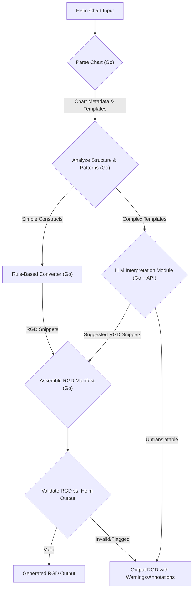
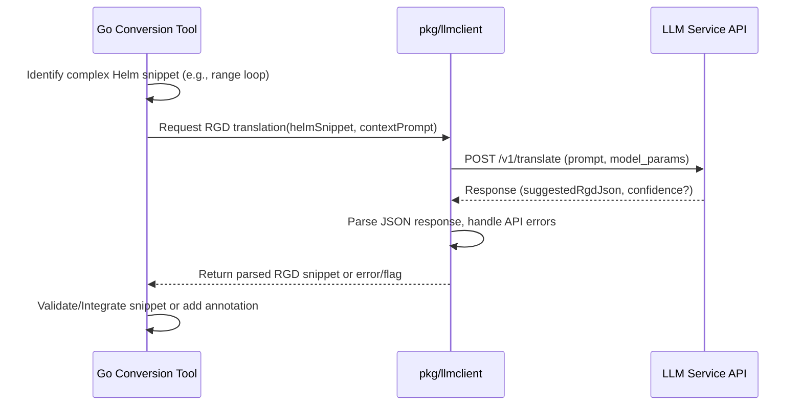

# Google Summer of Code 2025 Proposal

# AI-Powered Helm to RGD Conversion Tool

<style>
@page {
  @bottom-right {
    content: counter(page);
    font-family: Arial, sans-serif;
    font-size: 10pt;
  }
}
</style>

## Table of Contents
1.  [Personal Information](#personal-information)
2.  [Project Abstract](#project-abstract)
3.  [Background and Motivation](#background-and-motivation)
4.  [Project Goals and Scope](#project-goals-and-scope)
5.  [Technical Implementation Plan](#technical-implementation-plan)
6.  [Architecture Diagrams](#architecture-diagrams)
7.  [Mock Code Implementations](#mock-code-implementations)
8.  [Timeline and Deliverables](#timeline-and-deliverables)
9.  [Personal Qualifications and Fit](#personal-qualifications-and-fit)
10. [Conclusion](#conclusion)

---

## Personal Information
- **Name:** Munish Mummadi
- **Email:** moneymindedmunish1@gmail.com
- **GitHub:** https://github.com/MunishMummadi
- **LinkedIn:** https://www.linkedin.com/in/munishmummadi/
- **Portfolio:** https://www.munishdev.fun/
- **University:** Saint Louis University
- **Degree:** Masters in Computer Information Science (Expected May 2025)
- **Time Zone:** CDT (Central Daylight Time)
- **Availability:** Full-time commitment (40 hours/week) during the GSoC period.

Note: Markdown version of this proposal is at : https://github.com/MunishMummadi/gsoc/blob/main/2025/kro/final-proposal-6.md

## Project Abstract

This project aims to develop an AI-powered tool that converts existing Helm charts into Kro's Resource Group Definitions (RGDs). Helm is the package manager for Kubernetes but its templating can lead to complexity. Kro RGDs offer a more structured, Kubernetes-native way to define resource groupings. This tool will bridge the gap by analyzing Helm chart structures, identifying common patterns mappable to RGDs, developing strategies using AI and rule-based systems to handle Helm's templating logic, and implementing robust validation mechanisms. Key components include a Go-based analysis engine, an LLM integration module, a rule-based converter, and a validation framework. The ultimate goal is to increase the adoption of Kro by providing an automated pathway for migrating existing Kubernetes configurations defined in Helm.

## Background and Motivation

### About Helm and Kro RGDs

**Helm:** Helm helps manage Kubernetes applications through Helm Charts, which package versioned, pre-configured application resources. Helm uses a Go-based templating engine (`text/template` with Sprig functions) to customize Kubernetes manifests based on user-provided values. While powerful, this templating is Turing-complete, allowing complex logic that can sometimes obscure the final resource structure and make charts hard to manage or migrate.

**Kro RGDs:** Kro (Kube Resource Orchestrator) simplifies defining complex multi-resource constructs via its `ResourceGraphDefinition` (RGD) custom resource. RGDs provide a declarative, Kubernetes-native way to define resource collections, dependencies, and default configurations, aiming for better structure and reusability compared to raw Helm templates. Kro's controller manages the lifecycle of these grouped resources.

### The Need for Helm to RGD Conversion

As organizations explore alternatives or complementary tools to Helm for managing Kubernetes complexity, Kro presents a compelling option with its structured RGD approach. However, migrating existing applications packaged as Helm charts to RGDs manually can be a significant undertaking due to:

1.  **Volume of Existing Charts:** Many organizations have substantial investments in existing Helm charts.
2.  **Helm Templating Complexity:** Deciphering complex Helm templates (`if/else`, `range`, `tpl`, `include`, custom helpers) and mapping them accurately to RGD structures is non-trivial and error-prone.
3.  **Adoption Barrier:** The lack of an automated migration path presents a barrier to adopting Kro for users heavily invested in Helm.

An automated conversion tool would significantly lower this barrier, allowing users to leverage their existing Helm chart logic while transitioning to or experimenting with Kro's RGD model.

### Project Relevance

This project directly addresses the challenge of migrating from Helm to Kro, making it highly relevant to Kro's adoption and ecosystem growth. It will:

1.  **Lower Adoption Barrier:** Provide a practical tool to help users migrate existing applications.
2.  **Showcase RGD Capabilities:** Demonstrate how Helm concepts can be represented within the RGD framework.
3.  **Leverage AI for DevTools:** Explore the application of modern AI/LLMs to solve complex code translation problems in the DevOps/Kubernetes space.
4.  **Provide Migration Insights:** The analysis involved will yield insights into common Helm patterns and how they map (or don't map) to RGDs, potentially informing future Kro features or documentation.
5.  **Create a Valuable Community Tool:** An open-source Helm-to-RGD converter would be a valuable asset for the Kro community.

## Project Goals and Scope

The primary goal of this project is to develop a tool that assists users in converting Helm charts to Kro RGDs, focusing on the following key areas:

1.  **Develop an AI-driven system:** Create a core conversion engine using Go and LLMs/GenAI to transform Helm chart structures and values into equivalent RGD manifests. This includes managing LLM API calls, parsing responses, and integrating results.
2.  **Build Helm Chart Analysis Tools:** Implement utilities (likely in Go) to statically analyze Helm charts (`Chart.yaml`, `values.yaml`, templates/*). These tools will identify recurring patterns (e.g., simple value substitutions, resource loops, conditional blocks), template complexities (nested functions, `tpl` usage), and dependencies relevant for RGD mapping.
3.  **Address Helm Templating Complexity:** Research and develop strategies (combining AI interpretation with rule-based systems) to handle Helm's Go templating logic. This involves:
    * Mapping common, directly translatable Helm functions/constructs to RGD equivalents using rules.
    * Employing LLMs to interpret more complex or idiomatic Helm templating logic.
    * Clearly identifying and flagging Helm constructs that are too complex or ambiguous for automated conversion, providing context for manual review.
4.  **Implement Validation:** Create mechanisms to validate that the generated RGDs accurately reflect the intended resources, configurations, and functionality of the original Helm chart. This involves comparing the Kubernetes manifests generated by `helm template` and `kro render`.

The project will focus on creating a functional conversion *assistant*, acknowledging that 100% automated conversion for all possible Helm charts might be infeasible due to Helm's Turing completeness. The tool will aim for high accuracy on common patterns and provide clear guidance where manual intervention is needed.

## Technical Implementation Plan

### Methodology and Approach

The development of the Helm-to-RGD conversion tool will follow a systematic, iterative approach, combining static analysis, rule-based conversion, and AI/LLM-based interpretation. The core idea is to handle predictable Helm patterns efficiently using rules and leverage LLMs for more complex, nuanced template logic, while always providing mechanisms for validation and flagging ambiguities.

The implementation will be divided into phases, starting with foundational parsing and analysis, moving to core conversion logic (both rule-based and AI-driven), and culminating in robust validation and documentation.

### Phase Details

#### Phase 1: Foundational Analysis & Pattern Identification (Weeks 1-3)

* **Deep Dive:** Thoroughly study Kro's RGD specification (structure, schema, capabilities) and the Helm chart format, templating engine (Go `text/template`, Sprig functions), and common usage patterns.
* **Tooling Setup:** Set up the Go development environment, CI/CD basics (e.g., GitHub Actions for linting/testing), and identify relevant Go libraries:
    * YAML parsing: `gopkg.in/yaml.v3`
    * Helm interaction: Potentially use the official Helm Go SDK (`helm.sh/helm/v3/pkg/...`) for parsing charts and rendering templates, or fallback to CLI wrappers if needed.
    * Static analysis: Explore Go's `text/template` parsing capabilities or AST analysis if feasible for identifying template structures.
* **Chart Parser:** Develop a Go module (`pkg/helmparser`) to parse Helm charts (`Chart.yaml`, `values.yaml`, templates directory). This tool will extract metadata, default values, template file contents, and potentially identify basic template structures (e.g., `define`, `include`).
* **Pattern Analysis:** Analyze a corpus of diverse Helm charts (e.g., from popular repositories like Bitnami, Artifact Hub) to identify:
    * Common structural patterns (e.g., single deployment + service, statefulset + PVC).
    * Frequently used Helm functions (e.g., `include`, `tpl`, `required`, default Sprig functions).
    * Common templating idioms (e.g., loops for creating multiple resources, conditional resource inclusion).
    * Categorize patterns based on their direct mappability to RGD concepts vs. those requiring complex interpretation.
* **Initial Mapping Rules:** Define initial, rule-based mappings in Go for simple Helm constructs to RGD equivalents (e.g., direct value injection `{{ .Values.someKey }}` mapped to RGD parameters, simple `if/else` controlling resource presence).

#### Phase 2: Core Conversion Engine & Basic AI Integration (Weeks 4-6)

* **Engine Skeleton:** Build the main Go application structure (`cmd/helm2rgd`) and core conversion logic (`pkg/converter`). It will take a Helm chart path as input and orchestrate parsing, analysis, conversion (rule-based and AI), and output generation.
* **Rule-Based Conversion:** Implement the initial mapping rules defined in Phase 1 within `pkg/converter`. Handle straightforward conversions of Kubernetes resource definitions found within Helm templates into the RGD `resources` array structure.
* **LLM Integration Strategy:**
    * Research and select appropriate LLM APIs (e.g., OpenAI's API, Google's Gemini API). Prioritize models strong in code understanding/translation (e.g., GPT-4, Gemini Pro).
    * Define the interaction model: The Go application will identify complex template snippets, construct specific prompts asking the LLM to translate the Helm Go template logic into an equivalent RGD structure or parameterization, and parse the structured response (e.g., JSON).
    * Develop an LLM client module (`pkg/llmclient`) in Go to handle API requests, retries, error handling, and response parsing.
* **AI for Template Interpretation (Proof of Concept):** Develop a PoC focusing on a specific complex pattern (e.g., a `range` loop generating multiple ConfigMap entries based on a `Values` array).
    * Isolate the Helm template snippet.
    * Craft a detailed prompt explaining the context (input values, desired RGD output structure).
    * Send to LLM API via `pkg/llmclient`.
    * Parse the LLM's suggested RGD JSON snippet.
    * Integrate the parsed snippet into the main RGD structure being built.
* **Handling Values:** Implement logic to merge default `values.yaml` with user-provided values (`-f` flag or `--set`) before the conversion process, making these values available to both rule-based and AI conversion steps.

#### Phase 3: Advanced Conversion & Handling Complexity (Weeks 7-9)

* **Refining AI Prompts:** Iterate on prompt engineering techniques:
    * Use few-shot prompting: Include examples of successful Helm-to-RGD translations in the prompt.
    * Provide clear structural context: Explain the surrounding RGD structure where the snippet should fit.
    * Request structured output: Ask the LLM to respond in JSON format matching a predefined Go struct for easier parsing.
    * Experiment with different LLMs or model parameters.
* **Addressing Turing Completeness & Untranslatable Logic:** This is crucial. The tool must be robust against Helm's flexibility.
    * **Hybrid Approach:** Enhance the analysis phase to better classify template sections. Simple sections go to the rule engine. Complex sections go to the LLM.
    * **LLM Confidence:** Attempt to get confidence scores or structured error messages from the LLM if translation is uncertain.
    * **Flagging:** If the LLM fails or expresses low confidence, or if the analysis identifies constructs known to be problematic (e.g., complex nested `tpl` calls, reliance on external chart helpers not easily representable), the tool should *not* fail silently. It should:
        * Generate the RGD for the translatable parts.
        * Insert clear comments/annotations within the generated RGD marking the sections that require manual review.
        * Provide a summary report listing the untranslated Helm template files/sections and the reasons.
    * **Focus:** The goal is high-accuracy *assistance*, acknowledging that 100% automated conversion for *all* charts is likely infeasible.
* **Analysis Tool Enhancement:** Enhance `pkg/helmparser` to specifically detect complex Go templating constructs (e.g., `range` over nested maps, multi-level `include`/`tpl`, custom template functions) that are likely candidates for LLM interpretation or manual review flagging.

#### Phase 4: Validation, Testing, and Documentation (Weeks 10-12)

* **Validation Framework:** Develop a validation module (`pkg/validator`) in Go.
    * **Input:** Original Helm chart path, path to generated RGD.
    * **Process:**
        1.  Render manifests from Helm: Execute `helm template <chart> [flags]` programmatically or via CLI.
        2.  Render manifests from RGD: Execute `kro render <rgd> [flags]` programmatically or via CLI.
        3.  Parse both sets of resulting YAML manifests.
        4.  **Compare:** Implement comparison logic. This could range from:
            * Simple resource count/kind/name matching.
            * Structural diffing of the YAML objects (using libraries like `github.com/google/go-cmp`).
            * Checking key fields known to be critical for functionality (e.g., image tags, service ports, config data).
    * **Output:** Report detailing discrepancies or confirming equivalence.
* **Testing:**
    * **Unit Tests:** Implement comprehensive unit tests for `helmparser`, `converter` rules, `llmclient`, and `validator` components using Go's standard `testing` package and libraries like `testify`. Mock LLM API calls.
    * **Integration Tests:** Create end-to-end tests using a diverse set of sample Helm charts (simple to complex). Run the full conversion process and validation, asserting expected RGD output or validation results.
* **Documentation:** Write comprehensive documentation in Markdown:
    * `README.md`: Project overview, installation, quick start.
    * User Guide: Detailed usage instructions, flags, explanation of output (including warnings/annotations).
    * Limitations Guide: Clearly document the scope, known limitations (especially regarding complex Helm features), and when manual intervention is expected.
    * Developer Guide: Code structure, how to contribute, how to run tests.
* **Final Polish & Submission:** Refine code based on feedback, ensure all tests pass, improve comments, finalize documentation, and prepare the final code submission according to GSoC guidelines.

### Technical Challenges and Solutions

* **Challenge 1: Handling Helm's Turing Completeness:** Helm templates can contain arbitrary Go template logic.
    * **Solution:** Implement a hybrid approach. Use rule-based conversion for common, deterministic patterns. Use LLMs for interpreting more complex logic, trained/prompted with examples. Crucially, implement robust flagging for constructs deemed too complex or ambiguous for automated translation, guiding the user towards manual review. The goal is assistance, not flawless conversion of every possible chart.
* **Challenge 2: Ensuring LLM Accuracy and Consistency:** LLMs can sometimes produce incorrect or inconsistent translations.
    * **Solution:** Employ rigorous prompt engineering (few-shot examples, clear instructions, requesting structured output like JSON). Implement validation checks on the LLM's output structure. Integrate the validation framework (Phase 4) to compare the final rendered manifests as a crucial end-to-end check. Use lower temperature settings for the LLM API to favor determinism.
* **Challenge 3: Mapping Helm Concepts to RGD:** Not all Helm patterns or functions have direct 1:1 equivalents in RGD's structure.
    * **Solution:** Focus on translating the *intent* and the final rendered resources. Analyze common Helm patterns and define standard RGD equivalents where possible. For complex helper templates (`_helpers.tpl`) or `tpl` function usage, the LLM might be prompted to understand the generated output and represent it in RGD. Flag patterns that cannot be mapped clearly.
* **Challenge 4: Validation Complexity:** Comparing the output of `helm template` and `kro render` needs to be robust.
    * **Solution:** Develop a multi-faceted validation approach. Compare resource counts, kinds, and names. Use structural diffing tools (e.g., `go-cmp`) for comparing manifest content, potentially ignoring insignificant fields (like default metadata added by Helm/Kro). Allow configuration for focusing validation on specific critical fields.
* **Challenge 5: Managing LLM Costs and Rate Limits:** Frequent LLM API calls can be costly and subject to rate limits.
    * **Solution:** Prioritize rule-based conversion for simple cases to minimize LLM calls. Implement caching for identical template snippets sent to the LLM (if applicable). Use efficient LLM models where possible. Allow users to configure API keys and potentially endpoints (for self-hosted models if relevant in the future).

### Tools and Technologies

The implementation will leverage the following tools and technologies:

1.  **Programming Languages:**
    * Go (primary language for the conversion tool)
2.  **Kubernetes/Helm Tools:**
    * Helm Go SDK (`helm.sh/helm/v3/pkg/...`) (preferred for parsing/rendering) or Helm CLI
    * Kubernetes client-go (for API type definitions)
    * YAML parsing (`gopkg.in/yaml.v3`)
3.  **AI/LLM:**
    * LLM APIs (OpenAI API / Google Gemini API)
    * Standard Go `net/http` client or specific Go client libraries for LLMs
4.  **Testing & Validation:**
    * Go standard `testing` library
    * `github.com/stretchr/testify` (assertions, mocking)
    * `net/http/httptest` (for mocking LLM API calls)
    * `github.com/google/go-cmp` (for deep object comparison/diffing)
5.  **Development Practices:**
    * Git / GitHub
    * CI/CD (GitHub Actions for linting, testing)
    * Unit Testing, Integration Testing

### Integration with Kro Codebase

The Helm-to-RGD conversion tool will be developed as a standalone CLI application but designed to integrate well with the Kro ecosystem:

1.  **Repository:** Ideally, housed within the `kro-run` GitHub organization, potentially as a separate repository (e.g., `kro-run/helm2rgd`) or within the main `kro` repository under a `cmd/` or `tools/` directory, based on mentor preference.
2.  **Dependencies:** It will depend on Kro's API types (`pkg/apis/kro/v1alpha1`) to generate valid RGD structures.
3.  **Build/Release:** Integrated into Kro's build process or have its own release mechanism using GitHub Actions.
4.  **Documentation:** User guides and examples will be added to the main Kro documentation website.
5.  **CI:** Code quality checks (linting, formatting, unit tests) will align with Kro's standards.

This approach ensures the tool is discoverable by Kro users and maintained alongside the core project.

## Architecture Diagrams

### Figure 1: Overall Conversion Workflow



### Figure 2: LLM Interaction Visualization



## Mock Code Implementations

*(Demo purpose only - actual impl will be more complex and include error handling, configuration, etc.)*

### Basic Helm Template Parser Snippet (`pkg/helmparser/parser.go`)

```go
package helmparser

import (
	"fmt"
	"os"
	"path/filepath"
	"strings"

	"gopkg.in/yaml.v3"
)

// HelmChart represents basic parsed chart info
type HelmChart struct {
	Metadata ChartMetadata
	Values   map[string]interface{}
	Templates map[string]string // file path -> content
}

// ChartMetadata mirrors Chart.yaml structure
type ChartMetadata struct {
	APIVersion  string `yaml:"apiVersion"`
	Name        string `yaml:"name"`
	Version     string `yaml:"version"`
	Description string `yaml:"description"`
}

// ParseChart loads and parses a Helm chart from a given path
func ParseChart(chartPath string) (*HelmChart, error) {
	chart := &HelmChart{
		Templates: make(map[string]string),
		Values:    make(map[string]interface{}),
	}

	chartYamlPath := filepath.Join(chartPath, "Chart.yaml")
	chartData, err := os.ReadFile(chartYamlPath)
	if err != nil {
		return nil, fmt.Errorf("failed to read Chart.yaml: %w", err)
	}
	if err := yaml.Unmarshal(chartData, &chart.Metadata); err != nil {
		return nil, fmt.Errorf("failed to unmarshal Chart.yaml: %w", err)
	}

	valuesYamlPath := filepath.Join(chartPath, "values.yaml")
	valuesData, err := os.ReadFile(valuesYamlPath)
	if err == nil {
		if err := yaml.Unmarshal(valuesData, &chart.Values); err != nil {
			return nil, fmt.Errorf("failed to unmarshal values.yaml: %w", err)
		}
	} else if !os.IsNotExist(err) {
		return nil, fmt.Errorf("failed to read values.yaml: %w", err)
	}

	templatesPath := filepath.Join(chartPath, "templates")
	err = filepath.Walk(templatesPath, func(path string, info os.FileInfo, err error) error {
		if err != nil {
			return err
		}
		if !info.IsDir() && (strings.HasSuffix(info.Name(), ".yaml") || strings.HasSuffix(info.Name(), ".yml") || strings.HasSuffix(info.Name(), ".tpl")) {
			content, readErr := os.ReadFile(path)
			if readErr != nil {
				return fmt.Errorf("could not read template %s: %w", path, readErr)
			}
			relPath, _ := filepath.Rel(chartPath, path)
			chart.Templates[relPath] = string(content)
		}
		return nil
	})

	if err != nil && !os.IsNotExist(err) {
		return nil, fmt.Errorf("failed while reading templates directory '%s': %w", templatesPath, err)
	}

	return chart, nil
}
```

### Conceptual LLM Interaction Snippet (`pkg/llmclient/client.go`)

```go
package llmclient

import (
	"bytes"
	"context"
	"encoding/json"
	"fmt"
	"net/http"
	"strings"
)

// LLMClient interacts with a generic LLM API for code translation
type LLMClient struct {
	APIKey     string
	Endpoint   string
	Model      string
	HTTPClient *http.Client
}

// TranslationRequest defines the structure for the LLM API call payload
type TranslationRequest struct {
	Model       string   `json:"model"`
	Prompt      string   `json:"prompt"`
	MaxTokens   int     `json:"max_tokens"`
	Temperature float64 `json:"temperature"`
}

// TranslationResponse defines expected structure from LLM API
type TranslationResponse struct {
	ID      string `json:"id"`
	Choices []struct {
		Text string `json:"text"`
	} `json:"choices"`
}

// New creates a new LLMClient
func New(apiKey, endpoint, model string) *LLMClient {
	return &LLMClient{
		APIKey:   apiKey,
		Endpoint: endpoint,
		Model:    model,
		HTTPClient: &http.Client{
			Timeout: 90 * time.Second,
		},
	}
}

// TranslateHelmToRGD sends a Helm template snippet and context prompt for translation
func (c *LLMClient) TranslateHelmToRGD(ctx context.Context, helmSnippet, contextPrompt string) (*TranslationResponse, error) {
	apiRequest := TranslationRequest{
		Model:       c.Model,
		Prompt:      contextPrompt + "\n\n" + helmSnippet,
		MaxTokens:   2048,
		Temperature: 0.1,
	}
	requestBody, err := json.Marshal(apiRequest)
	if err != nil {
		return nil, fmt.Errorf("failed to marshal LLM request: %w", err)
	}

	req, err := http.NewRequestWithContext(ctx, "POST", c.Endpoint, bytes.NewBuffer(requestBody))
	if err != nil {
		return nil, fmt.Errorf("failed to create LLM request: %w", err)
	}
	req.Header.Set("Authorization", "Bearer "+c.APIKey)
	req.Header.Set("Content-Type", "application/json")
	req.Header.Set("Accept", "application/json")

	resp, err := c.HTTPClient.Do(req)
	if err != nil {
		return nil, fmt.Errorf("failed to call LLM API: %w", err)
	}
	defer resp.Body.Close()

	var apiResponse TranslationResponse
	if err := json.NewDecoder(resp.Body).Decode(&apiResponse); err != nil {
		return nil, fmt.Errorf("failed to decode LLM JSON response: %w", err)
	}

	return &apiResponse, nil
}
```

## Timeline and Deliverables

*(Note: The table format from the previous version is replaced with the requested hierarchical format below)*

### 8.1 Project Timeline

The project will be executed over the standard GSoC timeline (approx. 12 weeks), with work divided into logical phases that build upon each other. The timeline includes buffer periods to account for unexpected challenges and allows for iterative refinement of deliverables.

#### Community Bonding Period (Pre-Coding)
**May 1 - May 26, 2025 (Approx.)**

* **Week 1-2:**
    * Engage with Kro mentors and community (Slack, meetings).
    * Set up development environment, familiarize with Kro and Helm Go SDK codebases.
    * Review existing Helm charts and RGD examples.
    * Refine project plan and milestones based on mentor feedback.
* **Week 3-4:**
    * Deepen understanding of Helm templating nuances and RGD schema.
    * Draft detailed specifications for the Helm parser and core conversion logic.
    * Explore potential LLM APIs and client libraries.

#### Phase 1: Foundational Analysis & Pattern Identification
**Weeks 1-3 (Approx. May 27 - June 16)**

* **Week 1:**
    * Implement core Helm chart parser (`pkg/helmparser`).
    * Begin analysis of diverse Helm charts.
    * Set up basic CI for linting and testing.
* **Week 2:**
    * Continue chart analysis, document common patterns and Helm functions used.
    * Define initial set of rule-based mappings for simple constructs.
* **Week 3:**
    * Implement initial rule-based mappings (`pkg/converter`).
    * Finalize analysis report on patterns and mapping strategies.
    * Prepare first milestone report/demo.

**Deliverable 1 (Approx. June 16):** Functional Helm chart parser tool, analysis report on common patterns, and initial rule-based mapping logic.

#### Phase 2: Core Conversion Engine & Basic AI Integration
**Weeks 4-6 (Approx. June 17 - July 7)**

* **Week 4:**
    * Build the main CLI application structure (`cmd/helm2rgd`).
    * Integrate parser and rule-based converter.
    * Implement value merging logic (`values.yaml`, `-f`, `--set`).
* **Week 5:**
    * Develop the LLM client module (`pkg/llmclient`).
    * Research and select LLM API/model.
    * Integrate LLM client with the core engine.
* **Week 6:**
    * Create a Proof-of-Concept demonstrating LLM interpretation for a specific complex Helm pattern.
    * Refine basic conversion tool skeleton.
    * Prepare mid-term evaluation report/demo.

**Deliverable 2 (Approx. July 7):** Basic conversion tool handling simple rules and value merging, with integrated LLM client and a PoC for AI-based interpretation.

#### Mid-term Evaluation
**Approx. July 8 - July 12**

* Review progress with mentors.
* Adjust project plan if necessary based on PoC results and analysis findings.
* Address any issues or concerns.

#### Phase 3: Advanced Conversion & Handling Complexity
**Weeks 7-9 (Approx. July 13 - August 3)**

* **Week 7:**
    * Iterate on LLM prompt engineering for better accuracy and structured output (few-shot, JSON format).
    * Implement the hybrid approach logic (classify sections for rule vs. LLM).
* **Week 8:**
    * Develop robust flagging/annotation mechanism for untranslatable or low-confidence sections.
    * Enhance the parser/analyzer to detect challenging Helm constructs.
* **Week 9:**
    * Expand rule-based conversions for more patterns identified in Phase 1.
    * Test and refine the complex pattern handling.
    * Prepare third milestone report/demo.

**Deliverable 3 (Approx. August 3):** Conversion tool with improved reliability, handling more complex patterns via AI/rules, and a clear mechanism for flagging sections requiring manual review.

#### Phase 4: Validation, Testing, and Documentation
**Weeks 10-12 (Approx. August 4 - August 25)**

* **Week 10:**
    * Develop the validation framework (`pkg/validator`) comparing `helm template` and `kro render` outputs.
    * Implement core comparison logic (structural diff).
    * Begin writing comprehensive unit tests.
* **Week 11:**
    * Develop integration tests using sample Helm charts.
    * Write user documentation (README, usage guide, limitations).
    * Write developer documentation (code structure, contributing).
* **Week 12:**
    * Finalize all documentation based on feedback.
    * Complete testing and ensure CI passes.
    * Buffer period for addressing any remaining issues.
    * Final polishing of all deliverables.
    * Submit final work.

**Deliverable 4 (Approx. August 25):** Completed Helm-to-RGD conversion tool, validation framework, comprehensive test suite, and full user/developer documentation.

#### Final Evaluation
**Approx. August 26 - September 2**

* Final review with mentors.
* Submit final code and documentation.
* Complete GSoC final evaluation.

---

### Detailed Deliverables

1.  **Helm-to-RGD Conversion Tool:** A command-line tool written in Go (`helm2rgd`) that takes a Helm chart as input and outputs a corresponding RGD manifest, including annotations for sections requiring manual review.
2.  **Helm Chart Analysis Utilities:** Go modules (`pkg/helmparser`, parts of `pkg/converter`) for parsing Helm charts and identifying structural patterns and template complexities.
3.  **LLM Integration Module:** A Go module (`pkg/llmclient`) for interacting with a configured LLM API, including prompt construction and response parsing for Helm template interpretation.
4.  **Validation Suite:** Go module (`pkg/validator`) and potentially scripts to compare the Kubernetes manifests generated by the original Helm chart and the generated RGD.
5.  **Documentation:**
    - User Guide (Usage, flags, interpreting output/warnings)
    - Developer Guide (Code structure, contribution guidelines)
    - Limitations Document (Scope, known untranslatable patterns)
6.  **Test Suite:** Comprehensive unit and integration tests for the developed Go code.
7.  **Regular Progress Reports:** Weekly updates and communication with mentors.

### Success Metrics

The success of this project will be measured by:

1.  **Functionality:** The tool successfully parses common Helm charts and generates syntactically valid RGDs.
2.  **Conversion Accuracy (Rule-Based):** High accuracy (>95%) in converting Helm constructs covered by the defined rule-based mappings, verified by the validation suite on test charts.
3.  **Conversion Assistance (AI-Based):** Demonstrable ability of the LLM integration to propose plausible RGD structures for common complex Helm patterns (e.g., loops, complex conditionals), even if requiring occasional manual refinement. Success is measured by *assistance*, not perfection.
4.  **Complexity Handling:** Effective identification and flagging of Helm constructs deemed too complex for automated conversion, providing clear guidance to the user.
5.  **Validation Effectiveness:** The validation framework reliably detects significant discrepancies between `helm template` and `kro render` outputs for converted charts.
6.  **Code Quality & Test Coverage:** Adherence to Go best practices, Kro project standards (if applicable), and achieving reasonable unit/integration test coverage (e.g., >70%).
7.  **Documentation:** Clear, comprehensive documentation enabling users to effectively use the tool and understand its limitations.

### Post-GSoC Plans

After the GSoC period, I aim to:

1.  **Address Feedback:** Incorporate feedback received during the final evaluation.
2.  **Maintenance:** Remain available to fix critical bugs discovered shortly after the program.
3.  **Community Support:** Help answer user questions about the tool within the Kro community channels.
4.  **Further Development (Interest):** Depending on community interest and my availability, potentially contribute further enhancements, such as supporting more complex Helm patterns, improving LLM prompts, or integrating with Kro's CI/CD for regression testing.
5.  **Knowledge Transfer:** Ensure the codebase and documentation are clear enough for other Kro contributors to understand and maintain.

## Personal Qualifications and Fit

### Relevant Skills and Experience

I am a Master's student in Computer Information Science at Saint Louis University (expected graduation May 2025) with a strong foundation in software engineering, particularly backend development using Go and Python. My academic background combined with over two years of cumulative experience through internships and significant personal projects provides me with the necessary skills to tackle this project.

### Technical Skills Relevant to the Project

* **Go (Golang):** Proficient. Developed high-performance Go applications (URL shortener, distributed web scraper), comfortable with concurrency, API design, CLI tools, testing.
* **API Integration:** Experience integrating third-party APIs (Alpaca, Google Maps, Twilio, Deepseek), directly applicable to using LLM APIs.
* **Kubernetes/Helm:** Foundational understanding of Kubernetes concepts. Basic experience with Helm usage. Eager to deepen knowledge of Helm internals (SDK, templating) and Kubernetes controllers/CRDs through this project.
* **AI/LLM:** Basic understanding of LLM concepts. Strong motivation and ability (demonstrated by learning Rust for Servo internship) to quickly learn prompt engineering techniques and practical LLM API usage for code translation tasks.
* **Parsing/Data Handling:** Experience parsing structured data (YAML, JSON) and handling complex data structures in Go projects.
* **Testing:** Proficient in unit testing and integration testing in Go (`testing`, `testify`). Experience with mocking external services.
* **DevOps Tools:** Familiar with Git, Docker, CI/CD concepts (GitHub Actions).

### Project Experience Relevant to the Project

My background includes projects demonstrating skills applicable to the Helm-to-RGD conversion tool:

1.  **Distributed Web Scraper (Go, Colly, Redis, SQLite, Prometheus):** Showcased ability to build complex Go applications, handle external data sources, manage state, and implement robust error handling – relevant for parsing charts and managing the conversion process.
2.  **URL Shortener (Go, Gin, GORM):** Demonstrated proficiency in building efficient Go applications, designing APIs, and achieving high test coverage – relevant for building a reliable CLI tool.
3.  **Internship Experience (Redvest & Servo):** Involved API integration, backend development (Node.js), deployment configurations, and contributing to a large codebase (Servo/Rust), highlighting adaptability and ability to work within existing systems.

### Motivation and Interest

I am highly motivated by this specific project because:

1.  **Technical Challenge:** The intersection of Helm's complexity, RGD's structure, and the application of AI/LLMs for code translation is a fascinating and challenging problem space.
2.  **Impactful Tool:** Creating a tool that directly helps users adopt Kro and manage Kubernetes configurations more effectively is a compelling goal.
3.  **Skill Development:** This project provides an ideal opportunity to gain deep, practical experience with Helm internals and Kubernetes CRD patterns (RGDs).
4.  **Contribution to Open Source:** I am eager to contribute meaningfully to an innovative open-source project in the cloud-native space.
5.  **Collaboration:** I look forward to collaborating with and learning from experienced mentors and developers in the Kro community.

### Commitment and Availability

I will complete my Master's degree in May 2025, allowing me to dedicate full-time effort (40 hours/week) to this GSoC project during the summer coding period. I have no other significant commitments planned. I am based in the CDT time zone (UTC-5) and am flexible in scheduling meetings to ensure effective collaboration with mentors across different time zones.

### Communication and Collaboration

I believe clear and consistent communication is vital for successful open-source collaboration. I commit to:

* Providing regular (e.g., weekly) progress updates via preferred channels (Slack, email, GitHub issues).
* Actively participating in scheduled mentor meetings and relevant community discussions.
* Seeking clarification promptly when facing blockers or uncertainties.
* Responding to feedback in a timely manner.
* Documenting design decisions and implementation details clearly in code comments and pull request descriptions.

### Previous Open Source Experience

While I am relatively new to large-scale open-source contributions, I have:

* Made contributions to the Servo web rendering engine (Rust) and dora-rs for fun and to learn rust, python gaining experience with pull requests, Git workflows(rebase, merge conflicts, branching etc) code reviews, and collaborative workflows on GitHub.
* Followed open-source best practices (documentation, testing) in my personal projects hosted on GitHub.

I am enthusiastic about deepening my involvement in the open-source community through GSoC and becoming an active contributor to Kro.

## Conclusion

### Project Summary

This proposal outlines the development of an AI-Powered Helm to RGD Conversion Tool. The project aims to bridge the gap between the popular Helm package manager and Kro's structured ResourceGraphDefinition (RGD) approach by creating a Go-based tool that leverages rule-based conversion and AI/LLM interpretation. It includes phases for analysis, core engine development, handling Helm's complexity, validation, testing, and documentation. The goal is to provide a valuable assistant tool that simplifies the migration process for users adopting Kro.

### Value to the Kro Project

This project offers significant value to Kro by:

1.  **Lowering the Barrier to Adoption:** Providing a migration path for users with existing Helm charts.
2.  **Enhancing the Ecosystem:** Adding a valuable tool to the Kro ecosystem that addresses a common user need.
3.  **Demonstrating Kro's Flexibility:** Showing how concepts from other tools can be represented using RGDs.
4.  **Driving Community Engagement:** Attracting users interested in migrating from Helm.
5.  **Providing Insights:** The development process may reveal insights into Helm patterns useful for Kro documentation or future features.

### Personal Interest and Growth

This project aligns perfectly with my academic background and career interests. It offers an exceptional opportunity to:

1.  Gain deep expertise in Helm internals and Kubernetes CRD patterns (RGDs).
2.  Develop practical skills in applying AI/LLMs to solve real-world software engineering problems (code translation).
3.  Master advanced Go development techniques for building robust developer tools.
4.  Contribute meaningfully to an innovative open-source project in the cloud-native space.
5.  Collaborate with and learn from experienced mentors and developers in the Kro community.

I am confident in my ability to successfully complete this project and deliver a high-quality, valuable tool for the Kro community.

## Acknowledgments

I would like to express my gratitude to the Kro maintainers for proposing this exciting project idea and for considering my application. I also thank the Google Summer of Code program for providing this fantastic opportunity for students to contribute to open source. I am eager to potentially collaborate with the Kro team and contribute to the project's success.
