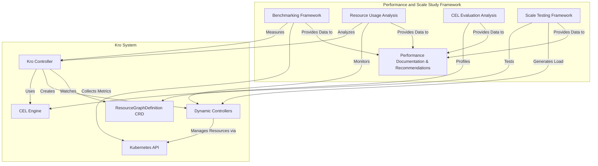
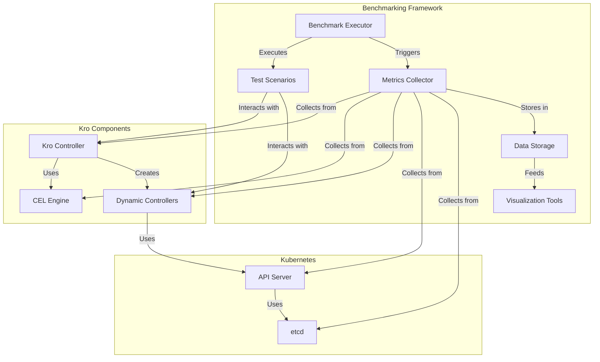
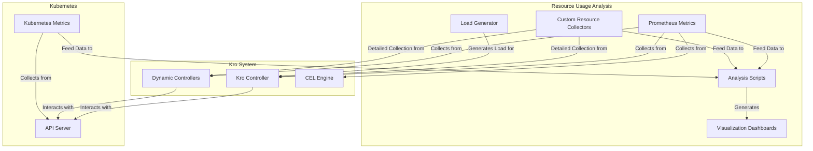
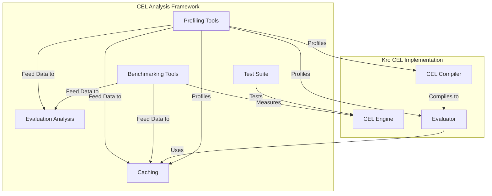
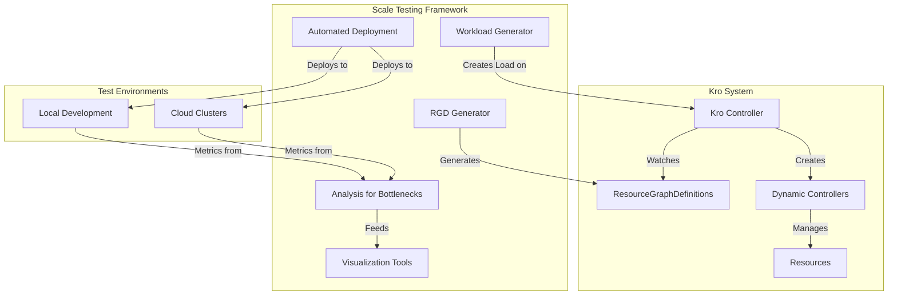
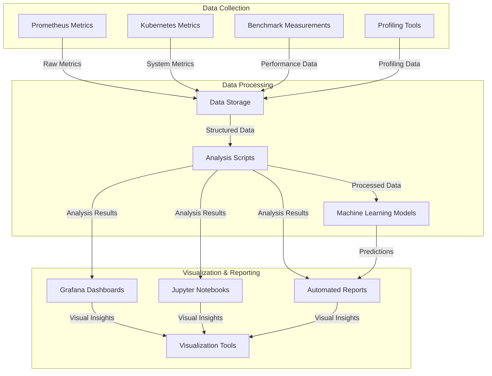
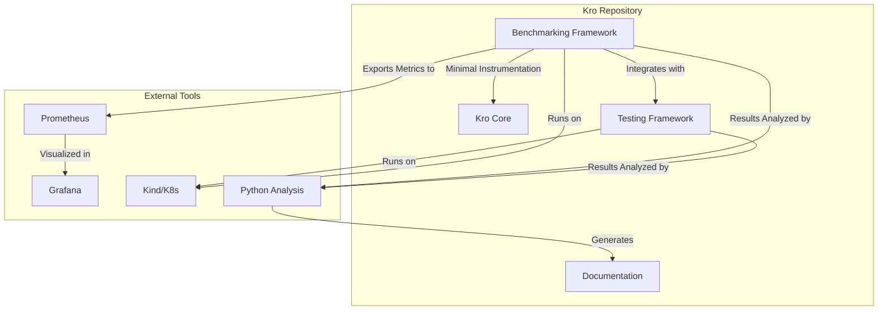
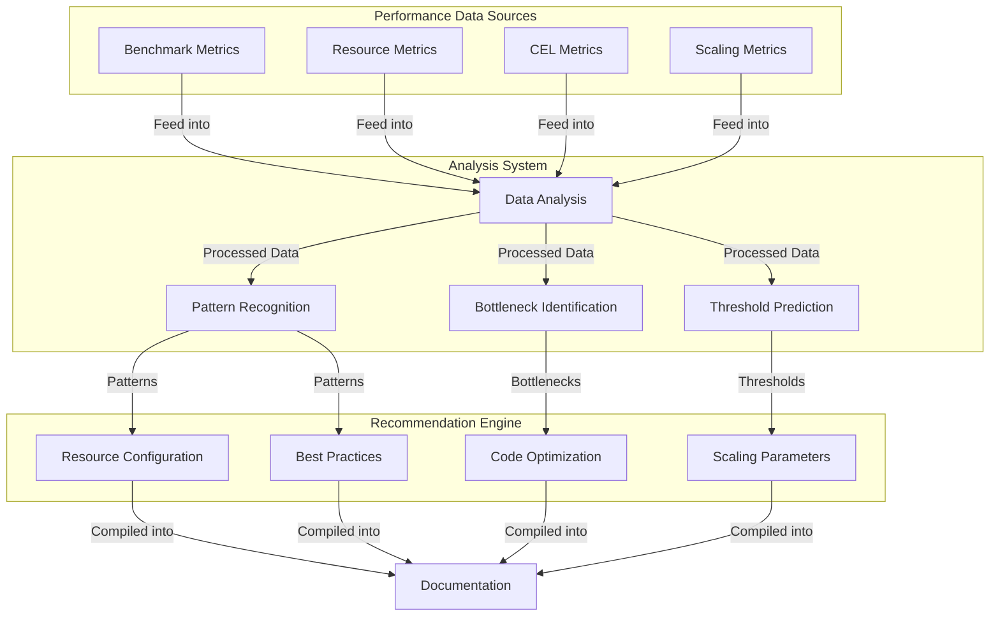

# Google Summer of Code 2025 Proposal
# Performance and Scale Study for Kro (Kube Resource Orchestrator)

## Table of Contents
1. [Personal Information](#personal-information)
2. [Project Abstract](#project-abstract)
3. [Background and Motivation](#background-and-motivation)
4. [Project Goals and Scope](#project-goals-and-scope)
5. [Technical Implementation Plan](#technical-implementation-plan)
6. [Architecture Diagrams](#architecture-diagrams)
7. [Mock Code Implementations](#mock-code-implementations)
8. [Timeline and Deliverables](#timeline-and-deliverables)
9. [Personal Qualifications and Fit](#personal-qualifications-and-fit)
10. [Conclusion](#conclusion)

## Personal Information
- **Name:** Munish Mummadi
- **Email:** moneymindedmunish1@gmail.com
- **GitHub:** https://github.com/MunishMummadi
- **LinkedIn:** https://www.linkedin.com/in/munishmummadi/
- **University:** Saint Louis University
- **Degree:** Masters in Computer Information Science (Expected May 2025)

## Project Abstract

Kro (Kube Resource Orchestrator) is a Kubernetes operator that simplifies the creation and management of complex custom resources by providing a Kubernetes-native way to define groupings of resources. As Kro continues to grow in adoption, understanding its performance characteristics and scaling capabilities becomes crucial for production deployments. This project aims to conduct a comprehensive performance and scale study of Kro, focusing on resource usage patterns, CEL expression evaluation performance, and overall system behavior under load.

The project will design and implement performance benchmarks, analyze resource consumption patterns, study CEL expression evaluation efficiency, create a scale testing framework, and document performance recommendations. The deliverables will provide valuable insights for both Kro users and developers, enabling informed decisions about resource allocation, optimization opportunities, and scaling strategies.

## Background and Motivation

### About Kro

Kro (Kube Resource Orchestrator) helps define complex multi-resource constructs as reusable components in Kubernetes applications and systems. It provides a vendor-agnostic way to define groupings of Kubernetes resources through its fundamental custom resource, the ResourceGraphDefinition. This allows users to define collections of underlying Kubernetes resources, specify dependencies between them, and include default configurations.

The Kro controller determines dependencies between resources, establishes the correct order of operations, and dynamically creates and manages all underlying resources. This approach significantly simplifies the creation and management of complex Kubernetes resource configurations.

### The Need for Performance and Scale Study

As Kro matures and gains adoption, understanding its performance characteristics becomes increasingly important for several reasons:

1. **Production Readiness**: Organizations need confidence in Kro's ability to handle production workloads at scale before widespread adoption.

2. **Resource Planning**: Understanding resource consumption patterns helps users properly size their Kubernetes clusters and allocate appropriate resources to Kro components.

3. **Performance Bottlenecks**: Identifying performance bottlenecks early allows the project to address them before they impact users in production environments.

4. **CEL Expression Evaluation**: Common Expression Language (CEL) is used extensively in Kro for resource definitions and validation. Understanding its performance characteristics is crucial for optimizing complex resource graphs.

5. **Scaling Limits**: Determining the practical scaling limits of Kro helps set appropriate expectations and provides guidance for large-scale deployments.

Currently, Kro lacks comprehensive performance benchmarks and scaling studies. This project aims to fill that gap by designing and implementing a systematic approach to measuring, analyzing, and documenting Kro's performance characteristics.

### Project Relevance

This project aligns with Kro's development trajectory as it moves toward production readiness. The performance and scale study will:

1. Provide empirical data to guide optimization efforts
2. Establish baseline performance metrics for future comparisons
3. Create tools for continuous performance monitoring
4. Document best practices for deploying Kro at scale
5. Identify potential architectural improvements for better scalability

The results will benefit both the Kro development team and the broader user community by providing insights into how Kro behaves under various conditions and workloads.

## Project Goals and Scope

The primary goal of this project is to conduct a comprehensive performance and scale study of Kro, focusing on the following key areas:

1. **Design and implement performance benchmarks**
   - Create reproducible benchmarks for measuring Kro's performance
   - Develop tools to automate benchmark execution and data collection
   - Establish baseline performance metrics for different configurations

2. **Study resource usage patterns under load**
   - Analyze CPU, memory, and network usage of Kro components
   - Identify resource consumption patterns as scale increases
   - Determine resource requirements for different deployment scenarios

3. **Analyze CEL expression evaluation performance**
   - Measure the performance impact of different CEL expression complexities
   - Identify optimization opportunities for CEL evaluation
   - Develop guidelines for efficient CEL usage in ResourceGraphDefinitions

4. **Create scale testing framework**
   - Build a framework for testing Kro at different scales
   - Develop tools to generate test workloads of varying complexity
   - Create methodologies for consistent scale testing

5. **Document performance recommendations**
   - Compile findings into comprehensive documentation
   - Provide best practices for deploying and configuring Kro at scale
   - Suggest optimization strategies based on empirical data

The project will focus on measuring and analyzing performance rather than implementing specific optimizations, though recommendations for future optimization work will be a key deliverable.

## Technical Implementation Plan

### Methodology and Approach

The performance and scale study for Kro will follow a systematic approach, combining quantitative measurements with qualitative analysis. The implementation will be divided into several interconnected components, each addressing a specific aspect of the project goals.

### 1. Performance Benchmarking Framework

#### Design Principles
- **Reproducibility**: Benchmarks must be reproducible across different environments
- **Automation**: Fully automated execution and data collection
- **Configurability**: Parameterized to test different scenarios
- **Isolation**: Minimize interference from external factors

#### Implementation Details
- Develop a Go-based benchmarking framework that integrates with Kro's codebase
- Create standardized test scenarios with varying complexity levels
- Implement metrics collection for CPU, memory, network, and disk I/O
- Design a data storage format for benchmark results that facilitates analysis
- Build visualization tools for benchmark data

The benchmarking framework will be implemented as a separate package within the Kro codebase, allowing it to be maintained alongside the main project and used for continuous performance monitoring.

### 2. Resource Usage Analysis

#### Metrics to Collect
- CPU utilization (overall and per-component)
- Memory consumption patterns
- Network traffic (volume, patterns, latency)
- Disk I/O (for persistence operations)
- Kubernetes API server load

#### Implementation Details
- Instrument Kro components with Prometheus metrics
- Develop custom resource usage collectors for detailed analysis
- Create controlled load generation tools
- Implement analysis scripts to correlate resource usage with workload characteristics
- Design visualization dashboards for resource usage patterns

This component will leverage Kubernetes' built-in monitoring capabilities and extend them with custom instrumentation to provide deeper insights into Kro's resource consumption patterns.

### 3. CEL Expression Evaluation Analysis

#### Areas of Focus
- Performance impact of expression complexity
- Memory usage during evaluation
- Caching effectiveness
- Optimization opportunities

#### Implementation Details
- Create a test suite with varying CEL expression complexities
- Implement benchmarking tools specific to CEL evaluation
- Develop profiling tools to identify bottlenecks
- Analyze compilation vs. evaluation performance
- Study the impact of different expression patterns on performance

This analysis will involve close examination of Kro's CEL implementation, focusing on how different expression patterns affect performance and resource usage.

### 4. Scale Testing Framework

#### Design Principles
- **Progressive scaling**: Test from small to large deployments
- **Realistic workloads**: Model real-world usage patterns
- **Controlled environment**: Minimize external variables
- **Comprehensive metrics**: Collect data across all system components

#### Implementation Details
- Develop tools to generate ResourceGraphDefinitions of varying complexity
- Create automated deployment tools for test clusters of different sizes
- Implement workload generators that simulate real-world usage patterns
- Build analysis tools to identify scaling bottlenecks
- Design visualization tools for scaling behavior

The scale testing framework will be designed to run in both local development environments (using kind or minikube) and cloud-based Kubernetes clusters for larger-scale testing.

### 5. Performance Documentation and Recommendations

#### Documentation Components
- Benchmark methodology and results
- Resource usage analysis findings
- CEL performance characteristics
- Scaling behavior and limits
- Best practices and recommendations

#### Implementation Details
- Create a structured documentation format
- Develop templates for consistent reporting
- Implement automated report generation from benchmark data
- Design visualization tools for key findings
- Compile recommendations based on empirical data

The documentation will be integrated with Kro's existing documentation system and will include both technical details for developers and practical guidance for users.

### Technical Challenges and Solutions

#### Challenge 1: Creating Reproducible Benchmarks
**Solution**: Develop containerized benchmark environments with fixed resource allocations and isolated networking. Use statistical methods to account for variability and ensure meaningful comparisons.

#### Challenge 2: Generating Realistic Test Workloads
**Solution**: Analyze existing Kro deployments (if available) to understand typical usage patterns. Create parameterized workload generators that can simulate various real-world scenarios.

#### Challenge 3: Minimizing External Factors
**Solution**: Implement controls to account for Kubernetes scheduling variability, node resource contention, and other external factors. Use baseline measurements and differential analysis to isolate Kro's performance characteristics.

#### Challenge 4: Scaling Testing Environment
**Solution**: Design a multi-tiered testing approach, starting with local development environments for initial testing and progressing to larger cloud-based clusters for scale testing. Implement resource-efficient testing methods to maximize scale within budget constraints.

#### Challenge 5: Analyzing Complex Performance Data
**Solution**: Develop specialized analysis tools that can correlate performance metrics across different system components. Use statistical techniques to identify patterns and anomalies in the data.

### Tools and Technologies

The implementation will leverage the following tools and technologies:

1. **Programming Languages**:
   - Go (primary language for Kro and benchmarking tools)
   - Python (for data analysis and visualization)

2. **Kubernetes Tools**:
   - kind/minikube (for local testing)
   - kubectl and client-go (for cluster interaction)
   - Helm (for deployment management)

3. **Monitoring and Profiling**:
   - Prometheus (for metrics collection)
   - Grafana (for visualization)
   - pprof (for Go profiling)
   - eBPF (for kernel-level insights)

4. **Testing Frameworks**:
   - Go testing framework
   - Benchmark utilities
   - Custom load generators

5. **Data Analysis**:
   - Pandas (for data processing)
   - Matplotlib/Plotly (for visualization)
   - Jupyter notebooks (for interactive analysis)

6. **Documentation**:
   - Markdown
   - MkDocs (for documentation site generation)
   - Automated report generation tools

### Integration with Kro Codebase

The performance and scale study tools will be integrated with the Kro codebase in a way that minimizes disruption to the main development workflow while ensuring maintainability:

1. **Benchmarking Framework**: Implemented as a separate package within the Kro repository, following the project's coding standards and practices.

2. **Instrumentation**: Added to existing code with minimal overhead and the ability to disable in production.

3. **Testing Tools**: Developed as standalone utilities that can be run independently but integrate with Kro's testing infrastructure.

4. **Documentation**: Integrated with Kro's existing documentation system, following the same structure and style.

This approach ensures that the performance and scale study becomes a valuable part of Kro's development ecosystem rather than a one-time effort.

## Architecture Diagrams

### 1. Overall System Architecture



### 2. Benchmarking Framework Architecture



### 3. Resource Usage Analysis Architecture



### 4. CEL Expression Evaluation Analysis



### 5. Scale Testing Framework



### 6. Data Flow for Performance Analysis



### 7. Integration with Kro Codebase



### 8. Performance Recommendation System



## Mock Code Implementations

### 1. Benchmarking Framework Core

```go
// pkg/benchmark/framework.go
package benchmark

import (
	"context"
	"fmt"
	"time"
	
	"github.com/prometheus/client_golang/prometheus"
	metav1 "k8s.io/apimachinery/pkg/apis/meta/v1"
	"k8s.io/client-go/kubernetes"
	"github.com/kro-run/kro/pkg/apis/kro/v1alpha1"
)

// BenchmarkSuite represents a collection of benchmark tests
type BenchmarkSuite struct {
	Name        string
	Description string
	Tests       []*BenchmarkTest
	
	// Common configuration for all tests in the suite
	Config      BenchmarkConfig
}

// BenchmarkTest represents a single benchmark test
type BenchmarkTest struct {
	Name        string
	Description string
	Setup       func(context.Context) error
	Run         func(context.Context) error
	Teardown    func(context.Context) error
	
	// Test-specific configuration
	Config      BenchmarkConfig
}

// BenchmarkConfig contains configuration for benchmark tests
type BenchmarkConfig struct {
	Iterations  int
	Concurrency int
	Timeout     time.Duration
	
	// Kubernetes client configuration
	KubeClient  *kubernetes.Clientset
	
	// Kro-specific configuration
	KroNamespace string
}

// BenchmarkResult contains the results of a benchmark test
type BenchmarkResult struct {
	TestName    string
	StartTime   time.Time
	EndTime     time.Time
	Duration    time.Duration
	Success     bool
	Error       error
	
	// Metrics collected during the test
	CPUUsage    float64
	MemoryUsage float64
	APIRequests int
	
	// Test-specific metrics
	Metrics     map[string]float64
}

// NewBenchmarkSuite creates a new benchmark suite
func NewBenchmarkSuite(name, description string, config BenchmarkConfig) *BenchmarkSuite {
	return &BenchmarkSuite{
		Name:        name,
		Description: description,
		Config:      config,
		Tests:       make([]*BenchmarkTest, 0),
	}
}

// AddTest adds a test to the benchmark suite
func (s *BenchmarkSuite) AddTest(test *BenchmarkTest) {
	s.Tests = append(s.Tests, test)
}

// Run executes all tests in the benchmark suite
func (s *BenchmarkSuite) Run(ctx context.Context) ([]BenchmarkResult, error) {
	results := make([]BenchmarkResult, 0, len(s.Tests))
	
	for _, test := range s.Tests {
		// Merge suite config with test config
		config := s.Config
		if test.Config.Iterations > 0 {
			config.Iterations = test.Config.Iterations
		}
		if test.Config.Concurrency > 0 {
			config.Concurrency = test.Config.Concurrency
		}
		if test.Config.Timeout > 0 {
			config.Timeout = test.Config.Timeout
		}
		
		// Create context with timeout
		testCtx, cancel := context.WithTimeout(ctx, config.Timeout)
		defer cancel()
		
		// Setup test
		if err := test.Setup(testCtx); err != nil {
			return results, fmt.Errorf("failed to setup test %s: %w", test.Name, err)
		}
		
		// Run test
		result := BenchmarkResult{
			TestName:  test.Name,
			StartTime: time.Now(),
			Metrics:   make(map[string]float64),
		}
		
		// Start metrics collection
		metricsCollector := NewMetricsCollector(config)
		metricsCollector.Start(testCtx)
		
		// Run the test
		err := test.Run(testCtx)
		result.EndTime = time.Now()
		result.Duration = result.EndTime.Sub(result.StartTime)
		result.Success = err == nil
		result.Error = err
		
		// Stop metrics collection and gather metrics
		metrics := metricsCollector.Stop()
		result.CPUUsage = metrics.CPUUsage
		result.MemoryUsage = metrics.MemoryUsage
		result.APIRequests = metrics.APIRequests
		
		// Teardown test
		if teardownErr := test.Teardown(testCtx); teardownErr != nil {
			fmt.Printf("Warning: failed to teardown test %s: %v\n", test.Name, teardownErr)
		}
		
		results = append(results, result)
	}
	
	return results, nil
}
```

### 2. CEL Expression Test Suite

```go
// pkg/analysis/cel_test_suite.go
package analysis

import (
	"context"
	"fmt"
	"time"
	
	"github.com/google/cel-go/cel"
	"github.com/google/cel-go/checker/decls"
	"github.com/google/cel-go/common/types"
	"github.com/google/cel-go/common/types/ref"
	"github.com/google/cel-go/interpreter/functions"
	exprpb "google.golang.org/genproto/googleapis/api/expr/v1alpha1"
	
	"github.com/kro-run/kro/pkg/metrics"
)

// CELTestCase represents a test case for CEL expression evaluation
type CELTestCase struct {
	Name       string
	Expression string
	Complexity string
	Variables  map[string]interface{}
	Expected   interface{}
}

// CELTestSuite represents a suite of CEL expression tests
type CELTestSuite struct {
	Name      string
	TestCases []CELTestCase
}

// CELTestResult represents the result of a CEL expression test
type CELTestResult struct {
	TestCase  CELTestCase
	Duration  time.Duration
	Result    interface{}
	Error     error
	MemoryUsage int64
}

// NewCELTestSuite creates a new CEL test suite
func NewCELTestSuite(name string) *CELTestSuite {
	return &CELTestSuite{
		Name:      name,
		TestCases: make([]CELTestCase, 0),
	}
}

// AddTestCase adds a test case to the suite
func (s *CELTestSuite) AddTestCase(tc CELTestCase) {
	s.TestCases = append(s.TestCases, tc)
}

// Run executes all test cases in the suite
func (s *CELTestSuite) Run(ctx context.Context) ([]CELTestResult, error) {
	results := make([]CELTestResult, 0, len(s.TestCases))
	
	for _, tc := range s.TestCases {
		// Create a new CEL environment for each test case
		env, err := cel.NewEnv(cel.Declarations(
			decls.NewVar("spec", decls.NewMapType(decls.String, decls.Dyn)),
			decls.NewVar("metadata", decls.NewMapType(decls.String, decls.Dyn)),
			decls.NewVar("status", decls.NewMapType(decls.String, decls.Dyn)),
		))
		if err != nil {
			return results, fmt.Errorf("failed to create CEL environment: %w", err)
		}
		
		// Parse and check the expression
		parsed, issues := env.Parse(tc.Expression)
		if issues != nil && issues.Err() != nil {
			results = append(results, CELTestResult{
				TestCase: tc,
				Error:    issues.Err(),
			})
			continue
		}
		
		checked, issues := env.Check(parsed)
		if issues != nil && issues.Err() != nil {
			results = append(results, CELTestResult{
				TestCase: tc,
				Error:    issues.Err(),
			})
			continue
		}
		
		// Compile the expression
		program, err := env.Program(checked)
		if err != nil {
			results = append(results, CELTestResult{
				TestCase: tc,
				Error:    fmt.Errorf("failed to compile expression: %w", err),
			})
			continue
		}
		
		// Prepare variables
		vars := make(map[string]interface{})
		for k, v := range tc.Variables {
			vars[k] = v
		}
		
		// Evaluate the expression
		start := time.Now()
		val, _, err := program.Eval(vars)
		duration := time.Since(start)
		
		// Record metrics
		metrics.ObserveCELEvaluationTime(tc.Complexity, duration.Seconds())
		
		// Create result
		result := CELTestResult{
			TestCase: tc,
			Duration: duration,
			Error:    err,
		}
		
		if err == nil {
			result.Result = val.Value()
		}
		
		results = append(results, result)
	}
	
	return results, nil
}

// GenerateStandardTestSuite generates a standard test suite with varying complexity
func GenerateStandardTestSuite() *CELTestSuite {
	suite := NewCELTestSuite("standard")
	
	// Simple expressions
	suite.AddTestCase(CELTestCase{
		Name:       "simple_field_access",
		Expression: "spec.replicas",
		Complexity: "simple",
		Variables: map[string]interface{}{
			"spec": map[string]interface{}{
				"replicas": 3,
			},
		},
		Expected: 3,
	})
	
	// Medium complexity expressions
	suite.AddTestCase(CELTestCase{
		Name:       "medium_conditional",
		Expression: "spec.replicas > 1 ? 'multiple' : 'single'",
		Complexity: "medium",
		Variables: map[string]interface{}{
			"spec": map[string]interface{}{
				"replicas": 3,
			},
		},
		Expected: "multiple",
	})
	
	// Complex expressions
	suite.AddTestCase(CELTestCase{
		Name:       "complex_nested_access",
		Expression: "spec.template.spec.containers[0].resources.limits.cpu",
		Complexity: "complex",
		Variables: map[string]interface{}{
			"spec": map[string]interface{}{
				"template": map[string]interface{}{
					"spec": map[string]interface{}{
						"containers": []interface{}{
							map[string]interface{}{
								"resources": map[string]interface{}{
									"limits": map[string]interface{}{
										"cpu": "100m",
									},
								},
							},
						},
					},
				},
			},
		},
		Expected: "100m",
	})
	
	return suite
}
```

### 3. ResourceGraphDefinition Generator for Scale Testing

```go
// pkg/scale/generator.go
package scale

import (
	"fmt"
	"math/rand"
	"time"
	
	metav1 "k8s.io/apimachinery/pkg/apis/meta/v1"
	"github.com/kro-run/kro/pkg/apis/kro/v1alpha1"
)

// RGDGenerator generates ResourceGraphDefinitions for scale testing
type RGDGenerator struct {
	// Configuration for generation
	Config GeneratorConfig
	
	// Random number generator
	rand *rand.Rand
}

// GeneratorConfig contains configuration for the RGD generator
type GeneratorConfig struct {
	// Prefix for generated names
	NamePrefix string
	
	// Namespace for generated resources
	Namespace string
	
	// Complexity levels for generation
	ComplexityLevels []string
	
	// Number of resources per RGD for each complexity level
	ResourcesPerComplexity map[string]int
	
	// Number of properties per resource for each complexity level
	PropertiesPerComplexity map[string]int
	
	// Number of dependencies per resource for each complexity level
	DependenciesPerComplexity map[string]int
}

// NewRGDGenerator creates a new ResourceGraphDefinition generator
func NewRGDGenerator(config GeneratorConfig) *RGDGenerator {
	return &RGDGenerator{
		Config: config,
		rand:   rand.New(rand.NewSource(time.Now().UnixNano())),
	}
}

// GenerateRGD generates a ResourceGraphDefinition with the specified complexity
func (g *RGDGenerator) GenerateRGD(complexity string, index int) *v1alpha1.ResourceGraphDefinition {
	// Determine the number of resources based on complexity
	numResources := g.Config.ResourcesPerComplexity[complexity]
	if numResources == 0 {
		numResources = 1
	}
	
	// Generate a unique name for the RGD
	name := fmt.Sprintf("%s-%s-%d", g.Config.NamePrefix, complexity, index)
	
	// Create the RGD
	rgd := &v1alpha1.ResourceGraphDefinition{
		ObjectMeta: metav1.ObjectMeta{
			Name:      name,
			Namespace: g.Config.Namespace,
			Labels: map[string]string{
				"app.kubernetes.io/name":       "kro-scale-test",
				"app.kubernetes.io/component":  "rgd",
				"app.kubernetes.io/complexity": complexity,
				"app.kubernetes.io/index":      fmt.Sprintf("%d", index),
			},
		},
		Spec: v1alpha1.ResourceGraphDefinitionSpec{
			Schema: v1alpha1.Schema{
				APIVersion: "v1alpha1",
				Kind:       fmt.Sprintf("ScaleTest%s", complexity),
				Spec: map[string]interface{}{
					"replicas": map[string]interface{}{
						"type":    "integer",
						"default": 1,
					},
					"image": map[string]interface{}{
						"type":    "string",
						"default": "nginx:latest",
					},
				},
				Status: map[string]interface{}{},
			},
			Resources: make([]v1alpha1.Resource, 0, numResources),
		},
	}
	
	// Generate resources
	for i := 0; i < numResources; i++ {
		resource := g.generateResource(i, g.Config.PropertiesPerComplexity[complexity], 
                                      g.Config.DependenciesPerComplexity[complexity])
		rgd.Spec.Resources = append(rgd.Spec.Resources, resource)
	}
	
	return rgd
}

// generateResource generates a resource for the ResourceGraphDefinition
func (g *RGDGenerator) generateResource(index, numProperties, numDependencies int) v1alpha1.Resource {
	// Determine the resource type
	resourceTypes := []string{
		"apps/v1/Deployment",
		"v1/Service",
		"v1/ConfigMap",
		"v1/Secret",
		"networking.k8s.io/v1/Ingress",
	}
	
	resourceType := resourceTypes[index%len(resourceTypes)]
	resourceName := fmt.Sprintf("resource-%d", index)
	
	// Create the resource
	resource := v1alpha1.Resource{
		Name: resourceName,
		Type: resourceType,
		Properties: map[string]interface{}{
			"metadata": map[string]interface{}{
				"labels": map[string]interface{}{
					"app": "${.metadata.name}",
				},
			},
		},
	}
	
	// Add properties based on resource type
	switch resourceType {
	case "apps/v1/Deployment":
		resource.Properties["spec"] = map[string]interface{}{
			"replicas": "${.spec.replicas}",
			"selector": map[string]interface{}{
				"matchLabels": map[string]interface{}{
					"app": "${.metadata.name}",
				},
			},
			"template": map[string]interface{}{
				"metadata": map[string]interface{}{
					"labels": map[string]interface{}{
						"app": "${.metadata.name}",
					},
				},
				"spec": map[string]interface{}{
					"containers": []map[string]interface{}{
						{
							"name":  "main",
							"image": "${.spec.image}",
						},
					},
				},
			},
		}
	case "v1/Service":
		resource.Properties["spec"] = map[string]interface{}{
			"selector": map[string]interface{}{
				"app": "${.metadata.name}",
			},
			"ports": []map[string]interface{}{
				{
					"port":       80,
					"targetPort": 80,
				},
			},
		}
	}
	
	// Add dependencies
	if numDependencies > 0 && index > 0 {
		dependencies := make([]string, 0, numDependencies)
		for i := 0; i < numDependencies && i < index; i++ {
			dependencies = append(dependencies, fmt.Sprintf("resource-%d", index-i-1))
		}
		resource.DependsOn = dependencies
	}
	
	return resource
}
```

### 4. Automated Report Generation

```python
# pkg/analysis/report_generator.py
import json
import os
import matplotlib.pyplot as plt
import numpy as np
import pandas as pd
from datetime import datetime

class ReportGenerator:
    """Generates performance reports from benchmark data"""
    
    def __init__(self, data_dir, output_dir):
        """
        Initialize the report generator
        
        Args:
            data_dir: Directory containing benchmark data
            output_dir: Directory to write reports to
        """
        self.data_dir = data_dir
        self.output_dir = output_dir
        
        # Create output directory if it doesn't exist
        os.makedirs(output_dir, exist_ok=True)
    
    def generate_reports(self):
        """Generate all reports"""
        self.generate_benchmark_report()
        self.generate_resource_usage_report()
        self.generate_cel_performance_report()
        self.generate_scaling_report()
        self.generate_recommendations()
    
    def generate_benchmark_report(self):
        """Generate benchmark performance report"""
        # Load benchmark data
        benchmark_file = os.path.join(self.data_dir, 'benchmark_results.json')
        if not os.path.exists(benchmark_file):
            print(f"Benchmark data file {benchmark_file} not found")
            return
        
        with open(benchmark_file, 'r') as f:
            benchmark_data = json.load(f)
        
        # Create report
        report = {
            'title': 'Kro Performance Benchmark Report',
            'generated_at': datetime.now().isoformat(),
            'summary': self._generate_benchmark_summary(benchmark_data),
            'test_results': self._process_benchmark_results(benchmark_data),
        }
        
        # Write report to file
        report_file = os.path.join(self.output_dir, 'benchmark_report.json')
        with open(report_file, 'w') as f:
            json.dump(report, f, indent=2)
        
        # Generate visualizations
        self._generate_benchmark_visualizations(benchmark_data)
    
    def _generate_benchmark_summary(self, benchmark_data):
        """Generate summary statistics for benchmark data"""
        total_tests = len(benchmark_data)
        successful_tests = sum(1 for test in benchmark_data if test.get('success', False))
        
        return {
            'total_tests': total_tests,
            'successful_tests': successful_tests,
            'failed_tests': total_tests - successful_tests,
            'success_rate': successful_tests / total_tests if total_tests > 0 else 0,
        }
    
    def _generate_benchmark_visualizations(self, benchmark_data):
        """Generate visualizations for benchmark data"""
        # Create a DataFrame from the benchmark data
        df = pd.DataFrame(benchmark_data)
        
        # Create output directory for visualizations
        viz_dir = os.path.join(self.output_dir, 'visualizations')
        os.makedirs(viz_dir, exist_ok=True)
        
        # Generate duration by test visualization
        if 'test_name' in df.columns and 'duration' in df.columns:
            plt.figure(figsize=(12, 6))
            df.groupby('test_name')['duration'].mean().plot(kind='bar')
            plt.title('Average Duration by Test')
            plt.ylabel('Duration (seconds)')
            plt.tight_layout()
            plt.savefig(os.path.join(viz_dir, 'duration_by_test.png'))
            plt.close()
```

## Timeline and Deliverables

### Project Timeline

The project will be executed over the standard GSoC timeline, with work divided into logical phases that build upon each other. The timeline includes buffer periods to account for unexpected challenges and allows for iterative refinement of deliverables.

#### Community Bonding Period (Pre-Coding)
**May 1 - May 26, 2025**

* Week 1-2:
  - Engage with Kro community through Slack and community meetings
  - Set up development environment and familiarize with codebase
  - Review existing performance-related issues and discussions
  - Refine project plan based on mentor feedback

* Week 3-4:
  - Study Kro's architecture in depth, particularly the CEL implementation
  - Explore existing testing infrastructure
  - Draft detailed specifications for benchmarking framework
  - Create initial prototypes for performance measurement tools

#### Phase 1: Benchmarking Framework Development
**May 27 - June 16, 2025**

* Week 1 (May 27 - June 2):
  - Implement core benchmarking framework structure
  - Develop initial test scenarios for basic Kro operations
  - Create metrics collection infrastructure
  - Set up automated benchmark execution

* Week 2 (June 3 - June 9):
  - Implement resource usage monitoring components
  - Develop data storage format for benchmark results
  - Create initial visualization tools
  - Begin testing framework with simple ResourceGraphDefinitions

* Week 3 (June 10 - June 16):
  - Refine benchmarking framework based on initial results
  - Implement additional test scenarios
  - Develop documentation for benchmarking framework
  - Prepare first milestone report

**Deliverable 1 (June 16):** Functional benchmarking framework with basic test scenarios and metrics collection

#### Phase 2: Resource Usage and CEL Analysis
**June 17 - July 7, 2025**

* Week 4 (June 17 - June 23):
  - Implement detailed resource usage analysis tools
  - Develop controlled load generation for resource testing
  - Begin collecting baseline resource usage data
  - Start analysis of resource consumption patterns

* Week 5 (June 24 - June 30):
  - Develop CEL expression test suite
  - Implement CEL-specific benchmarking tools
  - Begin collecting data on CEL expression performance
  - Start analysis of CEL evaluation patterns

* Week 6 (July 1 - July 7):
  - Refine resource usage analysis based on initial findings
  - Expand CEL test suite with more complex expressions
  - Develop visualization dashboards for resource and CEL metrics
  - Prepare mid-term evaluation report

**Deliverable 2 (July 7):** Resource usage analysis tools and CEL performance test suite with initial findings

#### Mid-term Evaluation
**July 8 - July 12, 2025**

* Review progress with mentors
* Adjust project plan if necessary
* Address any issues or concerns

#### Phase 3: Scale Testing Framework
**July 13 - August 3, 2025**

* Week 7 (July 13 - July 19):
  - Develop tools for generating complex ResourceGraphDefinitions
  - Implement automated deployment for test clusters
  - Create workload generators for scale testing
  - Begin initial scale tests

* Week 8 (July 20 - July 26):
  - Refine scale testing framework based on initial results
  - Implement analysis tools for scaling bottlenecks
  - Develop visualization tools for scaling behavior
  - Conduct more extensive scale tests

* Week 9 (July 27 - August 3):
  - Finalize scale testing framework
  - Conduct comprehensive scale tests
  - Analyze results and identify scaling limits
  - Prepare third milestone report

**Deliverable 3 (August 3):** Complete scale testing framework with comprehensive test results

#### Phase 4: Documentation and Recommendations
**August 4 - August 25, 2025**

* Week 10 (August 4 - August 10):
  - Compile all performance data and analysis
  - Draft performance characteristics documentation
  - Begin developing best practices and recommendations
  - Create visualization tools for key findings

* Week 11 (August 11 - August 17):
  - Refine documentation based on mentor feedback
  - Finalize best practices and recommendations
  - Integrate documentation with Kro's documentation system
  - Prepare final project report

* Week 12 (August 18 - August 25):
  - Buffer period for addressing any remaining issues
  - Final polishing of all deliverables
  - Complete code cleanup and documentation
  - Submit final work

**Deliverable 4 (August 25):** Comprehensive performance documentation and recommendations

#### Final Evaluation
**August 26 - September 2, 2025**

* Final review with mentors
* Submit final code and documentation
* Complete GSoC final evaluation

### Detailed Deliverables

#### 1. Performance Benchmarking Framework
* **Code Components:**
  - Core benchmarking infrastructure
  - Test scenario definitions
  - Metrics collection system
  - Data storage and retrieval
  - Visualization tools

* **Documentation:**
  - Framework architecture
  - Usage instructions
  - Test scenario descriptions
  - Extending the framework

#### 2. Resource Usage Analysis
* **Code Components:**
  - Resource monitoring instrumentation
  - Load generation tools
  - Analysis scripts
  - Visualization dashboards

* **Documentation:**
  - Resource usage patterns
  - Performance characteristics under different loads
  - Bottleneck identification
  - Resource requirement guidelines

#### 3. CEL Expression Evaluation Analysis
* **Code Components:**
  - CEL test suite
  - Performance measurement tools
  - Analysis scripts
  - Visualization tools

* **Documentation:**
  - CEL performance characteristics
  - Expression complexity impact
  - Optimization opportunities
  - Best practices for CEL usage

#### 4. Scale Testing Framework
* **Code Components:**
  - ResourceGraphDefinition generators
  - Automated deployment tools
  - Workload generators
  - Analysis tools
  - Visualization components

* **Documentation:**
  - Scaling behavior analysis
  - Practical scaling limits
  - Bottleneck identification
  - Scaling recommendations

#### 5. Performance Documentation and Recommendations
* **Documentation Components:**
  - Comprehensive performance characteristics
  - Resource usage guidelines
  - Scaling best practices
  - Configuration recommendations
  - Future optimization opportunities

### Success Metrics

The success of this project will be measured by the following criteria:

1. **Completeness of Deliverables:**
   - All planned components implemented and functional
   - Documentation comprehensive and integrated with Kro's documentation system
   - Code quality meeting Kro's standards

2. **Quality of Analysis:**
   - Depth and breadth of performance insights
   - Statistical validity of findings
   - Usefulness of recommendations

3. **Community Adoption:**
   - Tools integrated into Kro's development workflow
   - Documentation used by the community
   - Recommendations influencing future development

4. **Technical Achievements:**
   - Identification of performance bottlenecks
   - Practical scaling limits established
   - Clear path for future optimizations

### Post-GSoC Plans

After the completion of the GSoC period, I plan to:

1. Continue maintaining the performance and scale testing tools
2. Work with the Kro community to implement key optimizations identified during the project
3. Extend the framework to support new features as Kro evolves(although it is way out of league for my skillset but i will try my best)
4. Help integrate performance testing into Kro's CI/CD pipeline

This project is designed to provide long-term value to the Kro project beyond the GSoC period, establishing a foundation for ongoing performance monitoring and optimization.

## Personal Qualifications and Fit

### Relevant Skills and Experience

As a Masters student in Computer Information Science at Saint Louis University with a strong background in software engineering, I possess the technical skills and experience necessary to successfully execute this performance and scale study project for Kro.

#### Technical Skills Relevant to the Project

- **Go Programming**: I have developed multiple projects in Go, including a high-performance URL shortening microservice using the Gin framework that achieved response times under 50ms while handling over 1000 requests/second in load tests. My experience with Go's concurrency model and performance optimization techniques will be directly applicable to analyzing and benchmarking Kro's performance.

- **Distributed Systems**: I architected a distributed web scraping system in Go featuring circuit breakers, rate limiting, and proxy rotation. This experience with distributed systems design and implementation provides me with insights into the challenges of scaling distributed applications like Kro.

- **Performance Monitoring and Analysis**: I have implemented observability using Prometheus metrics, structured logging, and Grafana dashboards to monitor system health and performance. This experience will be valuable for developing the performance benchmarking framework for Kro.

- **Database and Data Processing**: My experience with various databases (PostgreSQL, MySQL, MongoDB, SQLite, Redis) and data processing tools will help in analyzing performance data and identifying patterns in resource usage.

- **Testing and Benchmarking**: I have experience with test-driven development and performance testing, having achieved over 80% unit test coverage in my URL shortener project and conducted load tests to verify performance characteristics.

#### Project Experience Relevant to Kro

While I don't have direct experience with Kro specifically, my background includes several projects that involve similar technical challenges:

1. **Distributed Web Scraper (Go, Redis, SQLite, Prometheus, Grafana)**: This project involved many of the same technical challenges that will be encountered in the Kro performance study, including:
   - Designing for scalability and fault tolerance
   - Implementing comprehensive monitoring and metrics collection
   - Analyzing performance bottlenecks
   - Optimizing resource usage under load

2. **URL Shortener (Go, Gin, GORM)**: This project demonstrated my ability to:
   - Build high-performance Go applications
   - Conduct thorough performance testing
   - Optimize for specific performance targets
   - Document performance characteristics

3. **Health Spot (React, Next.js, Node.js)**: While primarily a frontend project, this experience included:
   - Building scalable notification systems
   - Handling thousands of simulated concurrent requests
   - Implementing priority-based queuing for efficient API usage

### Motivation and Interest

I am particularly interested in this project for several reasons:

1. **Technical Challenge**: The performance and scale study of Kro presents a fascinating technical challenge that combines distributed systems, Kubernetes, performance analysis, and Go programming - all areas I'm passionate about.

2. **Real-world Impact**: Kro is solving a real problem in the Kubernetes ecosystem, and improving its performance and scalability will have a direct impact on users and organizations deploying complex applications on Kubernetes.

3. **Learning Opportunity**: This project offers an excellent opportunity to deepen my understanding of Kubernetes operators, CEL expression evaluation, and performance analysis techniques while working with experienced mentors and an active open-source community.

4. **Career Alignment**: As I complete my Masters degree in May 2025, this project aligns perfectly with my career interests in cloud-native technologies, distributed systems, and performance engineering.

### Commitment and Availability

I will be completing my Masters degree in May 2025, just as the GSoC program begins. This timing is ideal as I will be able to dedicate full-time effort to the project without academic commitments. I am prepared to commit 30-40 hours per week to ensure the successful completion of this project.

I have no planned vacations or other commitments during the GSoC period that would interfere with my ability to work on this project. I am located in the Central Time Zone (US) and am flexible with my working hours to accommodate meetings with mentors and the community regardless of their time zones.

### Communication and Collaboration

I understand the importance of regular communication in open-source projects and am committed to:

- Providing weekly progress updates to mentors and the community
- Actively participating in community meetings and discussions
- Seeking feedback early and often on design decisions and implementation approaches
- Documenting my work thoroughly to facilitate collaboration
- Being responsive to questions and feedback from mentors and community members

I have experience with collaborative development using Git, feature branching, and pull requests with code reviews, which will help me integrate smoothly with the Kro development workflow.

### Previous Open Source Experience

While my formal open source contributions have been limited, I have:

- Contributed to the Servo web rendering engine and dora-rs, implementing CSS property support & adding various nodes to dora based on new AI models
- Participated in collaborative development using feature branching and pull requests
- Followed open source development practices in my personal projects, including comprehensive documentation and test coverage

I am eager to expand my open source experience through this GSoC project and become an active contributor to the Kro community beyond the program's duration.

## Conclusion

### Project Summary

This proposal outlines a comprehensive performance and scale study for Kro (Kube Resource Orchestrator), addressing a critical need as the project matures toward production readiness. The project will deliver:

1. A robust performance benchmarking framework
2. Detailed analysis of resource usage patterns under load
3. Insights into CEL expression evaluation performance
4. A scale testing framework for evaluating Kro at different scales
5. Comprehensive documentation and recommendations for optimizing performance

By systematically analyzing Kro's performance characteristics, this project will provide valuable insights for both users and developers, enabling informed decisions about resource allocation, optimization opportunities, and scaling strategies.

### Value to the Kro Project

This performance and scale study will contribute significant value to the Kro project in several ways:

1. **Production Readiness**: By establishing performance baselines and identifying scaling limits, the project will help build confidence in Kro's readiness for production deployments.

2. **User Guidance**: The performance recommendations and best practices will help users deploy Kro effectively in their environments, avoiding common pitfalls and optimizing resource usage.

3. **Development Focus**: Identifying performance bottlenecks will help the development team prioritize optimization efforts for maximum impact.

4. **Long-term Monitoring**: The benchmarking and testing frameworks will provide tools for ongoing performance monitoring as the project evolves.

5. **Community Growth**: Clear performance characteristics and scaling guidance will make Kro more accessible to new users and organizations considering adoption.

### Personal Interest and Growth

This project represents an exciting opportunity for me to combine my technical skills in Go programming, distributed systems, and performance analysis with my interest in Kubernetes and cloud-native technologies. Working with the Kro community will allow me to:

1. Deepen my understanding of Kubernetes operators and controllers
2. Gain expertise in performance engineering for distributed systems
3. Contribute meaningfully to an important open-source project
4. Collaborate with experienced developers and mentors
5. Develop skills that align with my career interests in cloud-native technologies

I am committed to delivering high-quality work that meets the project's goals and contributes to Kro's success. I look forward to the opportunity to work with the Kro community and make a lasting contribution through this GSoC project.

### Acknowledgments

I would like to thank the Kro maintainers and the Google Summer of Code program for considering my proposal. I am excited about the possibility of contributing to this project and am ready to begin this journey of exploration, learning, and contribution.
